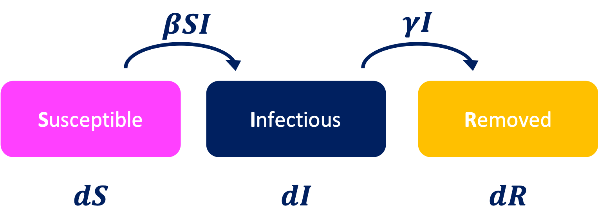
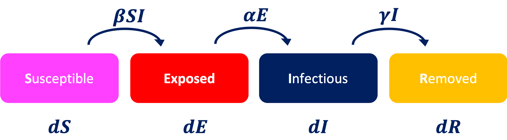
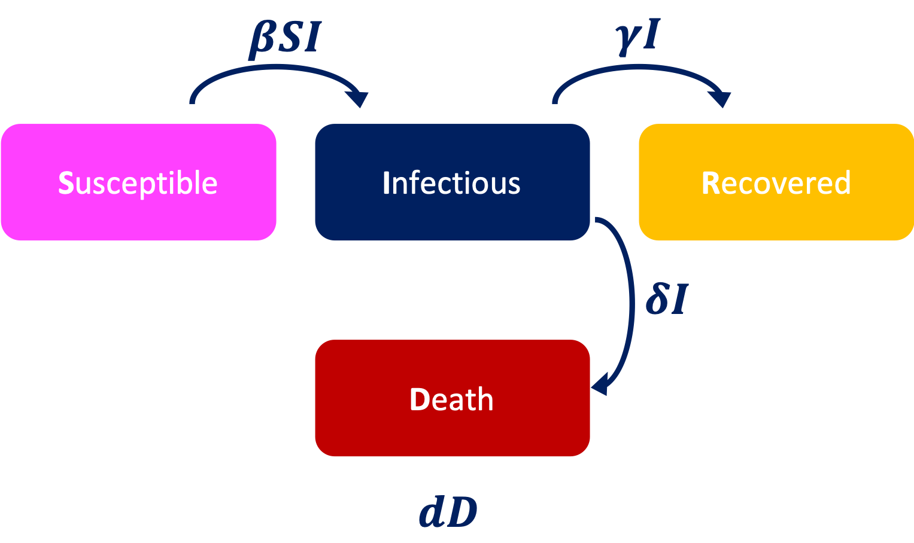
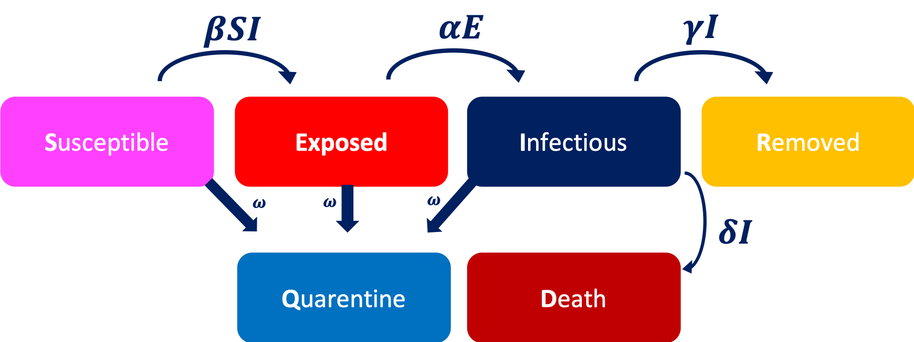

# COVID-19: an overview about stochastic forecasting 

This notebook aims to model the Covid 19 curve using a set of deterministic and stochastic approaches. 

We follow a **SIR** and **SEIR** differential equation that models the spread of a disease.


### 1. SIR model 

The **SIR** model (**Figure 1**) is the most poular mathematical description of the spread of a disease. It is based on the division of the entire population ( of **N**-size) into three states called **S**, **I** and **R**:

*S(t)* are the susceptible individual at time *t*;

*I(t)* is the number of infectious individuals at time *t*;

*R(t)* are removed individial (i.e., the recovered or death patients)

The model describes how the population changes between the states, depending of two parameters $\beta$ and $\gamma$, which describes the effective contact rate -i.e., $\beta$ controls how often a susceptible-infected contact results in a new infection- and the recovery rate - $\frac{1}{\gamma}$ is  the average period of time during which an infected individual can transmit the disease - , respectively. Mathematically, the model is:
    
\begin{equation}
\begin{split}
\frac{\partial S}{\partial t}& =-\beta I S\\
\frac{\partial I}{\partial t}& =\beta I S - \gamma I \\
\frac{\partial R}{\partial t}& =\gamma I  \\
\end{split}
\end{equation}


||
|:--:| 
| **Figure 1**: Scheme of SIR to model the spread of a disease |

We can add a quarentine effect into the equation 1 as follow: 

\begin{equation}
\begin{split}
\frac{\partial S}{\partial t}& =-\beta I S - \omega S\\
\frac{\partial I}{\partial t}& =\beta I S - \gamma I \\
\frac{\partial R}{\partial t}& =\gamma I  \\
\end{split}
\end{equation}

Where $\omega$ models the quarentine effect. 

### 2. SEIR model 

The **SEIR** model (**Figure 2**) considers four states, **S**, **E**, **I** and **R**, where **E** indicates the exposed incubation period during which individuals have been infected but are not yet infectious themselves. The model depends of two parameters $\beta$, $\alpha$ and $\gamma$. Mathematically, the model is:
    
\begin{equation}
\begin{split}
\frac{\partial S}{\partial t}& =-\beta I S  \\
\frac{\partial E}{\partial t}& =\beta I S -\alpha E \\
\frac{\partial I}{\partial t}& =\alpha E- \gamma I  \\
\frac{\partial R}{\partial t}& =\gamma I \\
\end{split}
\end{equation}

where $\frac{1}{\alpha}$ is the average time of incubation. 

An extension of the basic model, which take into account incubation time in exposed individual and the fact that  the exposed individuals can transmit the infection to susceptible ones can be formulated as follow: 

\begin{equation}
\begin{split}
\frac{\partial S}{\partial t}& =-\beta I S - \psi E S  \\
\frac{\partial E}{\partial t}& =\beta I S -\alpha E + \psi E S  \\
\frac{\partial I}{\partial t}& =\alpha E- \gamma I  \\
\frac{\partial R}{\partial t}& =\gamma I \\
\end{split}
\end{equation}
 
 where $\psi$ is the parameter which models the rate of interaction between an exposed and Susceptible individual. 


||
|:--:| 
| **Figure 2**: Scheme of SEIR to model the spread of a disease |

### 3. SIRD model 

The **SIRD** model (**Figure 3**) is the same than classical SIR, but considering the recovered and death individual in diferent compartmens, which adds one equation to the system: 
    
\begin{equation}
\begin{split}
\frac{\partial S}{\partial t}& =-\beta I S \\
\frac{\partial I}{\partial t}& =\beta I S - (\gamma  + \delta) I   \\
\frac{\partial R}{\partial t}& =\gamma I \\
\frac{\partial D}{\partial t}& =\delta I \\
\end{split}
\end{equation}

or adding quarentine information, we can model:
\begin{equation}
\begin{split}
\frac{\partial S}{\partial t}& =-\beta I S -\omega S\\
\frac{\partial I}{\partial t}& =\beta I S - (\gamma  + \delta) I   \\
\frac{\partial R}{\partial t}& =\gamma I \\
\frac{\partial D}{\partial t}& =\delta I \\
\end{split}
\end{equation}


||
|:--:| 
| **Figure 3**: Scheme of SIRD to model the spread of a disease |

### Adding quarentine information
The SEIR model adding death and quarentine information can be formulated as follow: 
\begin{equation}
\begin{split}
\frac{\partial S}{\partial t}& =-\beta I S - \psi  E  S - \omega  S  \\
\frac{\partial E}{\partial t}& =\beta I S -\alpha E +  \psi  E  S - \omega  E \\
\frac{\partial I}{\partial t}& =\alpha E - \theta I - \delta  I - \omega  I \\
\frac{\partial R}{\partial t}& =\gamma I + \omega (S + E + I) \\
\frac{\partial D}{\partial t}& = \delta I
\end{split}
\end{equation}

where $\delta$ models the rate of death individuals and \omega models the quarentine rate. 
The **Figure 4** shows the basic scheme of this model 


||
|:--:| 
| **Figure 4**: Scheme of SEIRDQ to model the spread of a disease |

### The data analysis

**1. Load requested libraries**


```python
import numpy as np 
import pandas as pd
import pymc3 as pm 
from scipy.integrate import solve_ivp 
from scipy import optimize 
from numba import jit
import theano #to wrapper
import theano.tensor as t 
import matplotlib.pyplot as plt
import altair as alt
import seaborn as sns 
plt.style.use('seaborn-talk') 
THEANO_FLAGS='optimizer=fast_compile' # A theano trick
```

**2. Load dataset**


```python
def load_individual_timeseries(name):
    base_url='https://raw.githubusercontent.com/CSSEGISandData/COVID-19/master/csse_covid_19_data/csse_covid_19_time_series'
    url = f'{base_url}/time_series_covid19_{name}_global.csv'
    df = pd.read_csv(url, 
                     index_col=['Country/Region', 'Province/State', 'Lat', 'Long'])
    df['type'] = name.lower()
    df.columns.name = 'date'
    
    df = (df.set_index('type', append=True)
            .reset_index(['Lat', 'Long'], drop=True)
            .stack()
            .reset_index()
            .set_index('date')
         )
    df.index = pd.to_datetime(df.index)
    df.columns = ['country', 'state', 'type', 'cases']
    
    # Hong Kong as state 
    df.loc[df.state =='Hong Kong', 'country'] = 'Hong Kong'
    df.loc[df.state =='Hong Kong', 'state'] = np.nan
    
    # Aggregate large countries split by states
    df = pd.concat([df, 
                    (df.loc[~df.state.isna()]
                     .groupby(['country', 'date', 'type'])
                     .sum()
                     .rename(index=lambda x: x+' (total)', level=0)
                     .reset_index(level=['country', 'type']))
                   ])
    return df

```


```python
def load_data(drop_states=False, p_crit=.05, filter_n_days_100=None):
    df = load_individual_timeseries('confirmed')
    df = df.rename(columns={'cases': 'confirmed'})
    if drop_states:
        # Drop states for simplicity
        df = df.loc[df.state.isnull()]
        
    # Estimated critical cases
    df = df.assign(critical_estimate=df.confirmed*p_crit)

    # Compute days relative to when 100 confirmed cases was crossed
    df.loc[:, 'days_since_100'] = np.nan
    for country in df.country.unique():
        if not df.loc[(df.country == country), 'state'].isnull().all():
            for state in df.loc[(df.country == country), 'state'].unique():
                df.loc[(df.country == country) & (df.state == state), 'days_since_100'] = \
                    np.arange(-len(df.loc[(df.country == country) & (df.state == state) & (df.confirmed < 100)]), 
                              len(df.loc[(df.country == country) & (df.state == state) & (df.confirmed >= 100)]))
        else:
            df.loc[(df.country == country), 'days_since_100'] = \
                np.arange(-len(df.loc[(df.country == country) & (df.confirmed < 100)]), 
                          len(df.loc[(df.country == country) & (df.confirmed >= 100)]))

    # Add recovered cases
#     df_recovered = load_individual_timeseries('Recovered')
#     df_r = df_recovered.set_index(['country', 'state'], append=True)[['cases']]
#     df_r.columns = ['recovered']

    # Add deaths
    df_deaths = load_individual_timeseries('deaths')
    df_d = df_deaths.set_index(['country', 'state'], append=True)[['cases']]
    df_d.columns = ['deaths']

    df = (df.set_index(['country', 'state'], append=True)
#             .join(df_r)
            .join(df_d)
            .reset_index(['country', 'state'])
    )
    
     #add recov
    df_recoveries = load_individual_timeseries('recovered')
    df_d = df_recoveries.set_index(['country', 'state'], append=True)[['cases']]
    df_d.columns = ['recovered']

    df = (df.set_index(['country', 'state'], append=True)
#             .join(df_r)
            .join(df_d)
            .reset_index(['country', 'state'])
    )

    if filter_n_days_100 is not None:
        # Select countries for which we have at least some information
        countries = pd.Series(df.loc[df.days_since_100 >= filter_n_days_100].country.unique())
        df = df.loc[lambda x: x.country.isin(countries)]

    return df
```


```python
data=load_data()

```

    /Users/teano/opt/anaconda3/lib/python3.7/site-packages/ipykernel_launcher.py:28: FutureWarning: Sorting because non-concatenation axis is not aligned. A future version
    of pandas will change to not sort by default.
    
    To accept the future behavior, pass 'sort=False'.
    
    To retain the current behavior and silence the warning, pass 'sort=True'.
    


```python
data= data.reset_index()

```


```python
data.head()
```


<div>
<style scoped>
    .dataframe tbody tr th:only-of-type {
        vertical-align: middle;
    }

    .dataframe tbody tr th {
        vertical-align: top;
    }

    .dataframe thead th {
        text-align: right;
    }
</style>
<table border="1" class="dataframe">
  <thead>
    <tr style="text-align: right;">
      <th></th>
      <th>date</th>
      <th>country</th>
      <th>state</th>
      <th>confirmed</th>
      <th>type</th>
      <th>critical_estimate</th>
      <th>days_since_100</th>
      <th>deaths</th>
      <th>recovered</th>
    </tr>
  </thead>
  <tbody>
    <tr>
      <td>0</td>
      <td>2020-01-22</td>
      <td>Afghanistan</td>
      <td>NaN</td>
      <td>0</td>
      <td>confirmed</td>
      <td>0.0</td>
      <td>-65.0</td>
      <td>0</td>
      <td>0.0</td>
    </tr>
    <tr>
      <td>1</td>
      <td>2020-01-23</td>
      <td>Afghanistan</td>
      <td>NaN</td>
      <td>0</td>
      <td>confirmed</td>
      <td>0.0</td>
      <td>-64.0</td>
      <td>0</td>
      <td>0.0</td>
    </tr>
    <tr>
      <td>2</td>
      <td>2020-01-24</td>
      <td>Afghanistan</td>
      <td>NaN</td>
      <td>0</td>
      <td>confirmed</td>
      <td>0.0</td>
      <td>-63.0</td>
      <td>0</td>
      <td>0.0</td>
    </tr>
    <tr>
      <td>3</td>
      <td>2020-01-25</td>
      <td>Afghanistan</td>
      <td>NaN</td>
      <td>0</td>
      <td>confirmed</td>
      <td>0.0</td>
      <td>-62.0</td>
      <td>0</td>
      <td>0.0</td>
    </tr>
    <tr>
      <td>4</td>
      <td>2020-01-26</td>
      <td>Afghanistan</td>
      <td>NaN</td>
      <td>0</td>
      <td>confirmed</td>
      <td>0.0</td>
      <td>-61.0</td>
      <td>0</td>
      <td>0.0</td>
    </tr>
  </tbody>
</table>
</div>


```python
data.country.unique()
```


    array(['Afghanistan', 'Albania', 'Algeria', 'Andorra', 'Angola',
           'Antigua and Barbuda', 'Argentina', 'Armenia', 'Australia',
           'Austria', 'Azerbaijan', 'Bahamas', 'Bahrain', 'Bangladesh',
           'Barbados', 'Belarus', 'Belgium', 'Benin', 'Bhutan', 'Bolivia',
           'Bosnia and Herzegovina', 'Brazil', 'Brunei', 'Bulgaria',
           'Burkina Faso', 'Cabo Verde', 'Cambodia', 'Cameroon', 'Canada',
           'Central African Republic', 'Chad', 'Chile', 'China', 'Hong Kong',
           'Colombia', 'Congo (Brazzaville)', 'Congo (Kinshasa)',
           'Costa Rica', "Cote d'Ivoire", 'Croatia', 'Diamond Princess',
           'Cuba', 'Cyprus', 'Czechia', 'Denmark', 'Djibouti',
           'Dominican Republic', 'Ecuador', 'Egypt', 'El Salvador',
           'Equatorial Guinea', 'Eritrea', 'Estonia', 'Eswatini', 'Ethiopia',
           'Fiji', 'Finland', 'France', 'Gabon', 'Gambia', 'Georgia',
           'Germany', 'Ghana', 'Greece', 'Guatemala', 'Guinea', 'Guyana',
           'Haiti', 'Holy See', 'Honduras', 'Hungary', 'Iceland', 'India',
           'Indonesia', 'Iran', 'Iraq', 'Ireland', 'Israel', 'Italy',
           'Jamaica', 'Japan', 'Jordan', 'Kazakhstan', 'Kenya',
           'Korea, South', 'Kuwait', 'Kyrgyzstan', 'Latvia', 'Lebanon',
           'Liberia', 'Liechtenstein', 'Lithuania', 'Luxembourg',
           'Madagascar', 'Malaysia', 'Maldives', 'Malta', 'Mauritania',
           'Mauritius', 'Mexico', 'Moldova', 'Monaco', 'Mongolia',
           'Montenegro', 'Morocco', 'Namibia', 'Nepal', 'Netherlands',
           'New Zealand', 'Nicaragua', 'Niger', 'Nigeria', 'North Macedonia',
           'Norway', 'Oman', 'Pakistan', 'Panama', 'Papua New Guinea',
           'Paraguay', 'Peru', 'Philippines', 'Poland', 'Portugal', 'Qatar',
           'Romania', 'Russia', 'Rwanda', 'Saint Lucia',
           'Saint Vincent and the Grenadines', 'San Marino', 'Saudi Arabia',
           'Senegal', 'Serbia', 'Seychelles', 'Singapore', 'Slovakia',
           'Slovenia', 'Somalia', 'South Africa', 'Spain', 'Sri Lanka',
           'Sudan', 'Suriname', 'Sweden', 'Switzerland', 'Taiwan*',
           'Tanzania', 'Thailand', 'Togo', 'Trinidad and Tobago', 'Tunisia',
           'Turkey', 'Uganda', 'Ukraine', 'United Arab Emirates',
           'United Kingdom', 'Uruguay', 'US', 'Uzbekistan', 'Venezuela',
           'Vietnam', 'Zambia', 'Zimbabwe', 'Dominica', 'Grenada',
           'Mozambique', 'Syria', 'Timor-Leste', 'Belize', 'Laos', 'Libya',
           'West Bank and Gaza', 'Guinea-Bissau', 'Mali',
           'Saint Kitts and Nevis', 'Kosovo', 'Burma', 'MS Zaandam',
           'Botswana', 'Burundi', 'Sierra Leone', 'Malawi', 'South Sudan',
           'Western Sahara', 'Sao Tome and Principe', 'Yemen',
           'Australia (total)', 'Canada (total)', 'China (total)',
           'Denmark (total)', 'France (total)', 'Netherlands (total)',
           'United Kingdom (total)'], dtype=object)


```python
data['active'] = data['confirmed'] - data['deaths'] - data['recovered']
```

# To explore coronavirus evolution
The following functions are custom function to plot the evolution of coronavirus in any country around the world. 
The functions also allow to see the evolution in all the countries. 


```python
#define function to create dataset by country or by all country
def country_data(data,allC=True,country="Spain",filtered=0):
    #data: the downloaded dataset
    #country: country code
    #allC 
    #filtered: filter by cases more than >> 
    #if country=="all" >> cases by all countries 
    if filtered<0:
        exit("filtered cannot be a negative number")
   
    if allC is True:
        data_country = data.groupby('date')['date', 'confirmed', 'deaths','active','recovered'].sum().reset_index()
    
    if allC is False:
        data_country = data.loc[data.country==country]
        data_country = data_country.groupby('date')['date', 'confirmed', 'deaths','active','recovered'].sum().reset_index()
    if filtered!=0: 
        data_country = data_country.loc[data_country.confirmed>int(filtered)]

    if (data_country.shape[0]==0):
        exit("The number of cases in the chosed country is lower than filtered")
    return data_country
```


```python
#defining dynamic plot function 
def Plot_info(data):
    confirmed_plot = alt.Chart(data).mark_circle(size=80, color='blue').encode(
    x=alt.X('date', axis=alt.Axis(title='Date')),
    y=alt.Y('confirmed', axis=alt.Axis(title='Cases')))

    deaths_plot = alt.Chart(data).mark_circle(size=80, color='red').encode(x='date',
    y='deaths')

    actives_plot = alt.Chart(data).mark_circle(size=80, color='green').encode(
    x='date',
    y='active')

    worldwide_plot = confirmed_plot + deaths_plot + actives_plot
    return worldwide_plot
```

**1. Worldwide Evolution**


```python
allc=country_data(data,allC=True)
Plot_info(allc)
```


<div id="altair-viz-2d7b8cff0e00490bac1dc863bc6bcc9f"></div>
<script type="text/javascript">
  (function(spec, embedOpt){
    let outputDiv = document.currentScript.previousElementSibling;
    if (outputDiv.id !== "altair-viz-2d7b8cff0e00490bac1dc863bc6bcc9f") {
      outputDiv = document.getElementById("altair-viz-2d7b8cff0e00490bac1dc863bc6bcc9f");
    }
    const paths = {
      "vega": "https://cdn.jsdelivr.net/npm//vega@5?noext",
      "vega-lib": "https://cdn.jsdelivr.net/npm//vega-lib?noext",
      "vega-lite": "https://cdn.jsdelivr.net/npm//vega-lite@4.8.1?noext",
      "vega-embed": "https://cdn.jsdelivr.net/npm//vega-embed@6?noext",
    };

    function loadScript(lib) {
      return new Promise(function(resolve, reject) {
        var s = document.createElement('script');
        s.src = paths[lib];
        s.async = true;
        s.onload = () => resolve(paths[lib]);
        s.onerror = () => reject(`Error loading script: ${paths[lib]}`);
        document.getElementsByTagName("head")[0].appendChild(s);
      });
    }

    function showError(err) {
      outputDiv.innerHTML = `<div class="error" style="color:red;">${err}</div>`;
      throw err;
    }

    function displayChart(vegaEmbed) {
      vegaEmbed(outputDiv, spec, embedOpt)
        .catch(err => showError(`Javascript Error: ${err.message}<br>This usually means there's a typo in your chart specification. See the javascript console for the full traceback.`));
    }

    if(typeof define === "function" && define.amd) {
      requirejs.config({paths});
      require(["vega-embed"], displayChart, err => showError(`Error loading script: ${err.message}`));
    } else if (typeof vegaEmbed === "function") {
      displayChart(vegaEmbed);
    } else {
      loadScript("vega")
        .then(() => loadScript("vega-lite"))
        .then(() => loadScript("vega-embed"))
        .catch(showError)
        .then(() => displayChart(vegaEmbed));
    }
  })({"config": {"view": {"continuousWidth": 400, "continuousHeight": 300}}, "layer": [{"mark": {"type": "circle", "color": "blue", "size": 80}, "encoding": {"x": {"type": "temporal", "axis": {"title": "Date"}, "field": "date"}, "y": {"type": "quantitative", "axis": {"title": "Cases"}, "field": "confirmed"}}}, {"mark": {"type": "circle", "color": "red", "size": 80}, "encoding": {"x": {"type": "temporal", "field": "date"}, "y": {"type": "quantitative", "field": "deaths"}}}, {"mark": {"type": "circle", "color": "green", "size": 80}, "encoding": {"x": {"type": "temporal", "field": "date"}, "y": {"type": "quantitative", "field": "active"}}}], "data": {"name": "data-bd5c6b1c28c9089c68e915708a279a1b"}, "$schema": "https://vega.github.io/schema/vega-lite/v4.8.1.json", "datasets": {"data-bd5c6b1c28c9089c68e915708a279a1b": [{"date": "2020-01-22T00:00:00", "confirmed": 1103, "deaths": 34, "active": 1013.0, "recovered": 56.0}, {"date": "2020-01-23T00:00:00", "confirmed": 1295, "deaths": 36, "active": 1199.0, "recovered": 60.0}, {"date": "2020-01-24T00:00:00", "confirmed": 1859, "deaths": 52, "active": 1735.0, "recovered": 72.0}, {"date": "2020-01-25T00:00:00", "confirmed": 2835, "deaths": 84, "active": 2673.0, "recovered": 78.0}, {"date": "2020-01-26T00:00:00", "confirmed": 4190, "deaths": 112, "active": 3976.0, "recovered": 101.0}, {"date": "2020-01-27T00:00:00", "confirmed": 5802, "deaths": 164, "active": 5518.0, "recovered": 119.0}, {"date": "2020-01-28T00:00:00", "confirmed": 11086, "deaths": 262, "active": 10614.0, "recovered": 208.0}, {"date": "2020-01-29T00:00:00", "confirmed": 12251, "deaths": 266, "active": 11737.0, "recovered": 246.0}, {"date": "2020-01-30T00:00:00", "confirmed": 16376, "deaths": 342, "active": 15752.0, "recovered": 280.0}, {"date": "2020-01-31T00:00:00", "confirmed": 19730, "deaths": 426, "active": 18862.0, "recovered": 438.0}, {"date": "2020-02-01T00:00:00", "confirmed": 23932, "deaths": 518, "active": 22849.0, "recovered": 561.0}, {"date": "2020-02-02T00:00:00", "confirmed": 33418, "deaths": 723, "active": 31754.0, "recovered": 937.0}, {"date": "2020-02-03T00:00:00", "confirmed": 39598, "deaths": 851, "active": 37504.0, "recovered": 1239.0}, {"date": "2020-02-04T00:00:00", "confirmed": 47599, "deaths": 982, "active": 44916.0, "recovered": 1697.0}, {"date": "2020-02-05T00:00:00", "confirmed": 55072, "deaths": 1126, "active": 51700.0, "recovered": 2241.0}, {"date": "2020-02-06T00:00:00", "confirmed": 61376, "deaths": 1266, "active": 57139.0, "recovered": 2966.0}, {"date": "2020-02-07T00:00:00", "confirmed": 68498, "deaths": 1436, "active": 63043.0, "recovered": 4012.0}, {"date": "2020-02-08T00:00:00", "confirmed": 73930, "deaths": 1610, "active": 67099.0, "recovered": 5214.0}, {"date": "2020-02-09T00:00:00", "confirmed": 79972, "deaths": 1810, "active": 71690.0, "recovered": 6465.0}, {"date": "2020-02-10T00:00:00", "confirmed": 85100, "deaths": 2024, "active": 75203.0, "recovered": 7866.0}, {"date": "2020-02-11T00:00:00", "confirmed": 89161, "deaths": 2224, "active": 77609.0, "recovered": 9321.0}, {"date": "2020-02-12T00:00:00", "confirmed": 89952, "deaths": 2234, "active": 77464.0, "recovered": 10247.0}, {"date": "2020-02-13T00:00:00", "confirmed": 120232, "deaths": 2739, "active": 104953.0, "recovered": 12533.0}, {"date": "2020-02-14T00:00:00", "confirmed": 133209, "deaths": 3043, "active": 114103.0, "recovered": 16056.0}, {"date": "2020-02-15T00:00:00", "confirmed": 137409, "deaths": 3328, "active": 115360.0, "recovered": 18714.0}, {"date": "2020-02-16T00:00:00", "confirmed": 141702, "deaths": 3535, "active": 116520.0, "recovered": 21640.0}, {"date": "2020-02-17T00:00:00", "confirmed": 145655, "deaths": 3731, "active": 116849.0, "recovered": 25067.0}, {"date": "2020-02-18T00:00:00", "confirmed": 149308, "deaths": 4009, "active": 116711.0, "recovered": 28580.0}, {"date": "2020-02-19T00:00:00", "confirmed": 150218, "deaths": 4236, "active": 113872.0, "recovered": 32102.0}, {"date": "2020-02-20T00:00:00", "confirmed": 151229, "deaths": 4483, "active": 110529.0, "recovered": 36209.0}, {"date": "2020-02-21T00:00:00", "confirmed": 152325, "deaths": 4487, "active": 110187.0, "recovered": 37642.0}, {"date": "2020-02-22T00:00:00", "confirmed": 155528, "deaths": 4899, "active": 104988.0, "recovered": 45632.0}, {"date": "2020-02-23T00:00:00", "confirmed": 155930, "deaths": 4912, "active": 104386.0, "recovered": 46623.0}, {"date": "2020-02-24T00:00:00", "confirmed": 156748, "deaths": 5222, "active": 101240.0, "recovered": 50276.0}, {"date": "2020-02-25T00:00:00", "confirmed": 158102, "deaths": 5371, "active": 97105.0, "recovered": 55615.0}, {"date": "2020-02-26T00:00:00", "confirmed": 159489, "deaths": 5485, "active": 93496.0, "recovered": 60497.0}, {"date": "2020-02-27T00:00:00", "confirmed": 161282, "deaths": 5558, "active": 89433.0, "recovered": 66278.0}, {"date": "2020-02-28T00:00:00", "confirmed": 162975, "deaths": 5660, "active": 84196.0, "recovered": 73105.0}, {"date": "2020-02-29T00:00:00", "confirmed": 165317, "deaths": 5776, "active": 80357.0, "recovered": 79164.0}, {"date": "2020-03-01T00:00:00", "confirmed": 168256, "deaths": 5867, "active": 77428.0, "recovered": 84937.0}, {"date": "2020-03-02T00:00:00", "confirmed": 170399, "deaths": 5998, "active": 73859.0, "recovered": 90515.0}, {"date": "2020-03-03T00:00:00", "confirmed": 173070, "deaths": 6106, "active": 71198.0, "recovered": 95736.0}, {"date": "2020-03-04T00:00:00", "confirmed": 175491, "deaths": 6237, "active": 67992.0, "recovered": 101229.0}, {"date": "2020-03-05T00:00:00", "confirmed": 178415, "deaths": 6363, "active": 65865.0, "recovered": 106150.0}, {"date": "2020-03-06T00:00:00", "confirmed": 182498, "deaths": 6504, "active": 66077.0, "recovered": 109868.0}, {"date": "2020-03-07T00:00:00", "confirmed": 186638, "deaths": 6630, "active": 65975.0, "recovered": 113979.0}, {"date": "2020-03-08T00:00:00", "confirmed": 190683, "deaths": 6902, "active": 65560.0, "recovered": 118157.0}, {"date": "2020-03-09T00:00:00", "confirmed": 194516, "deaths": 7112, "active": 65956.0, "recovered": 121372.0}, {"date": "2020-03-10T00:00:00", "confirmed": 199587, "deaths": 7402, "active": 67453.0, "recovered": 124654.0}, {"date": "2020-03-11T00:00:00", "confirmed": 206923, "deaths": 7777, "active": 70323.0, "recovered": 128716.0}, {"date": "2020-03-12T00:00:00", "confirmed": 209417, "deaths": 7893, "active": 70116.0, "recovered": 131292.0}, {"date": "2020-03-13T00:00:00", "confirmed": 226438, "deaths": 8584, "active": 83156.0, "recovered": 134506.0}, {"date": "2020-03-14T00:00:00", "confirmed": 237429, "deaths": 9012, "active": 89878.0, "recovered": 138342.0}, {"date": "2020-03-15T00:00:00", "confirmed": 248913, "deaths": 9643, "active": 95913.0, "recovered": 143106.0}, {"date": "2020-03-16T00:00:00", "confirmed": 263324, "deaths": 10348, "active": 106501.0, "recovered": 146064.0}, {"date": "2020-03-17T00:00:00", "confirmed": 279055, "deaths": 11143, "active": 117739.0, "recovered": 149700.0}, {"date": "2020-03-18T00:00:00", "confirmed": 297130, "deaths": 11986, "active": 131369.0, "recovered": 153126.0}, {"date": "2020-03-19T00:00:00", "confirmed": 325206, "deaths": 13130, "active": 155716.0, "recovered": 155569.0}, {"date": "2020-03-20T00:00:00", "confirmed": 355204, "deaths": 14570, "active": 180961.0, "recovered": 158742.0}, {"date": "2020-03-21T00:00:00", "confirmed": 388220, "deaths": 16257, "active": 207086.0, "recovered": 163619.0}, {"date": "2020-03-22T00:00:00", "confirmed": 421508, "deaths": 17953, "active": 231710.0, "recovered": 170397.0}, {"date": "2020-03-23T00:00:00", "confirmed": 463627, "deaths": 19811, "active": 270452.0, "recovered": 171301.0}, {"date": "2020-03-24T00:00:00", "confirmed": 504636, "deaths": 21940, "active": 297050.0, "recovered": 182882.0}, {"date": "2020-03-25T00:00:00", "confirmed": 555161, "deaths": 24504, "active": 337244.0, "recovered": 190192.0}, {"date": "2020-03-26T00:00:00", "confirmed": 618505, "deaths": 27313, "active": 388145.0, "recovered": 199043.0}, {"date": "2020-03-27T00:00:00", "confirmed": 683332, "deaths": 30562, "active": 438757.0, "recovered": 209385.0}, {"date": "2020-03-28T00:00:00", "confirmed": 752322, "deaths": 34028, "active": 491509.0, "recovered": 221270.0}, {"date": "2020-03-29T00:00:00", "confirmed": 812910, "deaths": 37314, "active": 537945.0, "recovered": 231435.0}, {"date": "2020-03-30T00:00:00", "confirmed": 876841, "deaths": 40993, "active": 581235.0, "recovered": 247295.0}, {"date": "2020-03-31T00:00:00", "confirmed": 953419, "deaths": 45545, "active": 622498.0, "recovered": 276950.0}, {"date": "2020-04-01T00:00:00", "confirmed": 1030039, "deaths": 50268, "active": 681677.0, "recovered": 288643.0}, {"date": "2020-04-02T00:00:00", "confirmed": 1113053, "deaths": 56482, "active": 733665.0, "recovered": 311761.0}, {"date": "2020-04-03T00:00:00", "confirmed": 1197022, "deaths": 62338, "active": 788640.0, "recovered": 333786.0}, {"date": "2020-04-04T00:00:00", "confirmed": 1299378, "deaths": 68206, "active": 858386.0, "recovered": 360026.0}, {"date": "2020-04-05T00:00:00", "confirmed": 1377128, "deaths": 73026, "active": 908298.0, "recovered": 380307.0}, {"date": "2020-04-06T00:00:00", "confirmed": 1451153, "deaths": 78309, "active": 955898.0, "recovered": 400722.0}, {"date": "2020-04-07T00:00:00", "confirmed": 1533673, "deaths": 85650, "active": 998596.0, "recovered": 431930.0}, {"date": "2020-04-08T00:00:00", "confirmed": 1620182, "deaths": 92167, "active": 1043509.0, "recovered": 465772.0}, {"date": "2020-04-09T00:00:00", "confirmed": 1706185, "deaths": 99384, "active": 1080943.0, "recovered": 505707.0}, {"date": "2020-04-10T00:00:00", "confirmed": 1804201, "deaths": 106515, "active": 1138143.0, "recovered": 538041.0}, {"date": "2020-04-11T00:00:00", "confirmed": 1885456, "deaths": 112599, "active": 1175745.0, "recovered": 574450.0}, {"date": "2020-04-12T00:00:00", "confirmed": 1961782, "deaths": 118250, "active": 1218324.0, "recovered": 601624.0}, {"date": "2020-04-13T00:00:00", "confirmed": 2033952, "deaths": 123710, "active": 1247790.0, "recovered": 637552.0}, {"date": "2020-04-14T00:00:00", "confirmed": 2094370, "deaths": 130337, "active": 1267908.0, "recovered": 669990.0}, {"date": "2020-04-15T00:00:00", "confirmed": 2175518, "deaths": 138646, "active": 1291975.0, "recovered": 717695.0}]}}, {"mode": "vega-lite"});
</script>


**2. Spain evolution**


```python
Sp=country_data(data,allC=False,country="Spain",filtered=0)
Plot_info(Sp)
```


<div id="altair-viz-3ecae80c966647cfb3e0d04f6e029347"></div>
<script type="text/javascript">
  (function(spec, embedOpt){
    let outputDiv = document.currentScript.previousElementSibling;
    if (outputDiv.id !== "altair-viz-3ecae80c966647cfb3e0d04f6e029347") {
      outputDiv = document.getElementById("altair-viz-3ecae80c966647cfb3e0d04f6e029347");
    }
    const paths = {
      "vega": "https://cdn.jsdelivr.net/npm//vega@5?noext",
      "vega-lib": "https://cdn.jsdelivr.net/npm//vega-lib?noext",
      "vega-lite": "https://cdn.jsdelivr.net/npm//vega-lite@4.8.1?noext",
      "vega-embed": "https://cdn.jsdelivr.net/npm//vega-embed@6?noext",
    };

    function loadScript(lib) {
      return new Promise(function(resolve, reject) {
        var s = document.createElement('script');
        s.src = paths[lib];
        s.async = true;
        s.onload = () => resolve(paths[lib]);
        s.onerror = () => reject(`Error loading script: ${paths[lib]}`);
        document.getElementsByTagName("head")[0].appendChild(s);
      });
    }

    function showError(err) {
      outputDiv.innerHTML = `<div class="error" style="color:red;">${err}</div>`;
      throw err;
    }

    function displayChart(vegaEmbed) {
      vegaEmbed(outputDiv, spec, embedOpt)
        .catch(err => showError(`Javascript Error: ${err.message}<br>This usually means there's a typo in your chart specification. See the javascript console for the full traceback.`));
    }

    if(typeof define === "function" && define.amd) {
      requirejs.config({paths});
      require(["vega-embed"], displayChart, err => showError(`Error loading script: ${err.message}`));
    } else if (typeof vegaEmbed === "function") {
      displayChart(vegaEmbed);
    } else {
      loadScript("vega")
        .then(() => loadScript("vega-lite"))
        .then(() => loadScript("vega-embed"))
        .catch(showError)
        .then(() => displayChart(vegaEmbed));
    }
  })({"config": {"view": {"continuousWidth": 400, "continuousHeight": 300}}, "layer": [{"mark": {"type": "circle", "color": "blue", "size": 80}, "encoding": {"x": {"type": "temporal", "axis": {"title": "Date"}, "field": "date"}, "y": {"type": "quantitative", "axis": {"title": "Cases"}, "field": "confirmed"}}}, {"mark": {"type": "circle", "color": "red", "size": 80}, "encoding": {"x": {"type": "temporal", "field": "date"}, "y": {"type": "quantitative", "field": "deaths"}}}, {"mark": {"type": "circle", "color": "green", "size": 80}, "encoding": {"x": {"type": "temporal", "field": "date"}, "y": {"type": "quantitative", "field": "active"}}}], "data": {"name": "data-d5bd48e603de661f5f23afb71845961c"}, "$schema": "https://vega.github.io/schema/vega-lite/v4.8.1.json", "datasets": {"data-d5bd48e603de661f5f23afb71845961c": [{"date": "2020-01-22T00:00:00", "confirmed": 0, "deaths": 0, "active": 0.0, "recovered": 0.0}, {"date": "2020-01-23T00:00:00", "confirmed": 0, "deaths": 0, "active": 0.0, "recovered": 0.0}, {"date": "2020-01-24T00:00:00", "confirmed": 0, "deaths": 0, "active": 0.0, "recovered": 0.0}, {"date": "2020-01-25T00:00:00", "confirmed": 0, "deaths": 0, "active": 0.0, "recovered": 0.0}, {"date": "2020-01-26T00:00:00", "confirmed": 0, "deaths": 0, "active": 0.0, "recovered": 0.0}, {"date": "2020-01-27T00:00:00", "confirmed": 0, "deaths": 0, "active": 0.0, "recovered": 0.0}, {"date": "2020-01-28T00:00:00", "confirmed": 0, "deaths": 0, "active": 0.0, "recovered": 0.0}, {"date": "2020-01-29T00:00:00", "confirmed": 0, "deaths": 0, "active": 0.0, "recovered": 0.0}, {"date": "2020-01-30T00:00:00", "confirmed": 0, "deaths": 0, "active": 0.0, "recovered": 0.0}, {"date": "2020-01-31T00:00:00", "confirmed": 0, "deaths": 0, "active": 0.0, "recovered": 0.0}, {"date": "2020-02-01T00:00:00", "confirmed": 1, "deaths": 0, "active": 1.0, "recovered": 0.0}, {"date": "2020-02-02T00:00:00", "confirmed": 1, "deaths": 0, "active": 1.0, "recovered": 0.0}, {"date": "2020-02-03T00:00:00", "confirmed": 1, "deaths": 0, "active": 1.0, "recovered": 0.0}, {"date": "2020-02-04T00:00:00", "confirmed": 1, "deaths": 0, "active": 1.0, "recovered": 0.0}, {"date": "2020-02-05T00:00:00", "confirmed": 1, "deaths": 0, "active": 1.0, "recovered": 0.0}, {"date": "2020-02-06T00:00:00", "confirmed": 1, "deaths": 0, "active": 1.0, "recovered": 0.0}, {"date": "2020-02-07T00:00:00", "confirmed": 1, "deaths": 0, "active": 1.0, "recovered": 0.0}, {"date": "2020-02-08T00:00:00", "confirmed": 1, "deaths": 0, "active": 1.0, "recovered": 0.0}, {"date": "2020-02-09T00:00:00", "confirmed": 2, "deaths": 0, "active": 2.0, "recovered": 0.0}, {"date": "2020-02-10T00:00:00", "confirmed": 2, "deaths": 0, "active": 2.0, "recovered": 0.0}, {"date": "2020-02-11T00:00:00", "confirmed": 2, "deaths": 0, "active": 2.0, "recovered": 0.0}, {"date": "2020-02-12T00:00:00", "confirmed": 2, "deaths": 0, "active": 2.0, "recovered": 0.0}, {"date": "2020-02-13T00:00:00", "confirmed": 2, "deaths": 0, "active": 2.0, "recovered": 0.0}, {"date": "2020-02-14T00:00:00", "confirmed": 2, "deaths": 0, "active": 2.0, "recovered": 0.0}, {"date": "2020-02-15T00:00:00", "confirmed": 2, "deaths": 0, "active": 0.0, "recovered": 2.0}, {"date": "2020-02-16T00:00:00", "confirmed": 2, "deaths": 0, "active": 0.0, "recovered": 2.0}, {"date": "2020-02-17T00:00:00", "confirmed": 2, "deaths": 0, "active": 0.0, "recovered": 2.0}, {"date": "2020-02-18T00:00:00", "confirmed": 2, "deaths": 0, "active": 0.0, "recovered": 2.0}, {"date": "2020-02-19T00:00:00", "confirmed": 2, "deaths": 0, "active": 0.0, "recovered": 2.0}, {"date": "2020-02-20T00:00:00", "confirmed": 2, "deaths": 0, "active": 0.0, "recovered": 2.0}, {"date": "2020-02-21T00:00:00", "confirmed": 2, "deaths": 0, "active": 0.0, "recovered": 2.0}, {"date": "2020-02-22T00:00:00", "confirmed": 2, "deaths": 0, "active": 0.0, "recovered": 2.0}, {"date": "2020-02-23T00:00:00", "confirmed": 2, "deaths": 0, "active": 0.0, "recovered": 2.0}, {"date": "2020-02-24T00:00:00", "confirmed": 2, "deaths": 0, "active": 0.0, "recovered": 2.0}, {"date": "2020-02-25T00:00:00", "confirmed": 6, "deaths": 0, "active": 4.0, "recovered": 2.0}, {"date": "2020-02-26T00:00:00", "confirmed": 13, "deaths": 0, "active": 11.0, "recovered": 2.0}, {"date": "2020-02-27T00:00:00", "confirmed": 15, "deaths": 0, "active": 13.0, "recovered": 2.0}, {"date": "2020-02-28T00:00:00", "confirmed": 32, "deaths": 0, "active": 30.0, "recovered": 2.0}, {"date": "2020-02-29T00:00:00", "confirmed": 45, "deaths": 0, "active": 43.0, "recovered": 2.0}, {"date": "2020-03-01T00:00:00", "confirmed": 84, "deaths": 0, "active": 82.0, "recovered": 2.0}, {"date": "2020-03-02T00:00:00", "confirmed": 120, "deaths": 0, "active": 118.0, "recovered": 2.0}, {"date": "2020-03-03T00:00:00", "confirmed": 165, "deaths": 1, "active": 162.0, "recovered": 2.0}, {"date": "2020-03-04T00:00:00", "confirmed": 222, "deaths": 2, "active": 218.0, "recovered": 2.0}, {"date": "2020-03-05T00:00:00", "confirmed": 259, "deaths": 3, "active": 254.0, "recovered": 2.0}, {"date": "2020-03-06T00:00:00", "confirmed": 400, "deaths": 5, "active": 393.0, "recovered": 2.0}, {"date": "2020-03-07T00:00:00", "confirmed": 500, "deaths": 10, "active": 460.0, "recovered": 30.0}, {"date": "2020-03-08T00:00:00", "confirmed": 673, "deaths": 17, "active": 626.0, "recovered": 30.0}, {"date": "2020-03-09T00:00:00", "confirmed": 1073, "deaths": 28, "active": 1013.0, "recovered": 32.0}, {"date": "2020-03-10T00:00:00", "confirmed": 1695, "deaths": 35, "active": 1628.0, "recovered": 32.0}, {"date": "2020-03-11T00:00:00", "confirmed": 2277, "deaths": 54, "active": 2040.0, "recovered": 183.0}, {"date": "2020-03-12T00:00:00", "confirmed": 2277, "deaths": 55, "active": 2039.0, "recovered": 183.0}, {"date": "2020-03-13T00:00:00", "confirmed": 5232, "deaths": 133, "active": 4906.0, "recovered": 193.0}, {"date": "2020-03-14T00:00:00", "confirmed": 6391, "deaths": 195, "active": 5679.0, "recovered": 517.0}, {"date": "2020-03-15T00:00:00", "confirmed": 7798, "deaths": 289, "active": 6992.0, "recovered": 517.0}, {"date": "2020-03-16T00:00:00", "confirmed": 9942, "deaths": 342, "active": 9070.0, "recovered": 530.0}, {"date": "2020-03-17T00:00:00", "confirmed": 11748, "deaths": 533, "active": 10187.0, "recovered": 1028.0}, {"date": "2020-03-18T00:00:00", "confirmed": 13910, "deaths": 623, "active": 12206.0, "recovered": 1081.0}, {"date": "2020-03-19T00:00:00", "confirmed": 17963, "deaths": 830, "active": 16026.0, "recovered": 1107.0}, {"date": "2020-03-20T00:00:00", "confirmed": 20410, "deaths": 1043, "active": 17779.0, "recovered": 1588.0}, {"date": "2020-03-21T00:00:00", "confirmed": 25374, "deaths": 1375, "active": 21874.0, "recovered": 2125.0}, {"date": "2020-03-22T00:00:00", "confirmed": 28768, "deaths": 1772, "active": 24421.0, "recovered": 2575.0}, {"date": "2020-03-23T00:00:00", "confirmed": 35136, "deaths": 2311, "active": 30250.0, "recovered": 2575.0}, {"date": "2020-03-24T00:00:00", "confirmed": 39885, "deaths": 2808, "active": 33283.0, "recovered": 3794.0}, {"date": "2020-03-25T00:00:00", "confirmed": 49515, "deaths": 3647, "active": 40501.0, "recovered": 5367.0}, {"date": "2020-03-26T00:00:00", "confirmed": 57786, "deaths": 4365, "active": 46406.0, "recovered": 7015.0}, {"date": "2020-03-27T00:00:00", "confirmed": 65719, "deaths": 5138, "active": 51224.0, "recovered": 9357.0}, {"date": "2020-03-28T00:00:00", "confirmed": 73235, "deaths": 5982, "active": 54968.0, "recovered": 12285.0}, {"date": "2020-03-29T00:00:00", "confirmed": 80110, "deaths": 6803, "active": 58598.0, "recovered": 14709.0}, {"date": "2020-03-30T00:00:00", "confirmed": 87956, "deaths": 7716, "active": 63460.0, "recovered": 16780.0}, {"date": "2020-03-31T00:00:00", "confirmed": 95923, "deaths": 8464, "active": 68200.0, "recovered": 19259.0}, {"date": "2020-04-01T00:00:00", "confirmed": 104118, "deaths": 9387, "active": 72084.0, "recovered": 22647.0}, {"date": "2020-04-02T00:00:00", "confirmed": 112065, "deaths": 10348, "active": 74974.0, "recovered": 26743.0}, {"date": "2020-04-03T00:00:00", "confirmed": 119199, "deaths": 11198, "active": 77488.0, "recovered": 30513.0}, {"date": "2020-04-04T00:00:00", "confirmed": 126168, "deaths": 11947, "active": 80002.0, "recovered": 34219.0}, {"date": "2020-04-05T00:00:00", "confirmed": 131646, "deaths": 12641, "active": 80925.0, "recovered": 38080.0}, {"date": "2020-04-06T00:00:00", "confirmed": 136675, "deaths": 13341, "active": 82897.0, "recovered": 40437.0}, {"date": "2020-04-07T00:00:00", "confirmed": 141942, "deaths": 14045, "active": 84689.0, "recovered": 43208.0}, {"date": "2020-04-08T00:00:00", "confirmed": 148220, "deaths": 14792, "active": 85407.0, "recovered": 48021.0}, {"date": "2020-04-09T00:00:00", "confirmed": 153222, "deaths": 15447, "active": 85610.0, "recovered": 52165.0}, {"date": "2020-04-10T00:00:00", "confirmed": 158273, "deaths": 16081, "active": 86524.0, "recovered": 55668.0}, {"date": "2020-04-11T00:00:00", "confirmed": 163027, "deaths": 16606, "active": 87312.0, "recovered": 59109.0}, {"date": "2020-04-12T00:00:00", "confirmed": 166831, "deaths": 17209, "active": 87231.0, "recovered": 62391.0}, {"date": "2020-04-13T00:00:00", "confirmed": 170099, "deaths": 17756, "active": 87616.0, "recovered": 64727.0}, {"date": "2020-04-14T00:00:00", "confirmed": 172541, "deaths": 18056, "active": 86981.0, "recovered": 67504.0}, {"date": "2020-04-15T00:00:00", "confirmed": 177644, "deaths": 18708, "active": 88083.0, "recovered": 70853.0}]}}, {"mode": "vega-lite"});
</script>


**3. Argentina evolution**


```python
Arg=country_data(data,allC=False,country='Argentina',filtered=100)
Plot_info(Arg)
```


<div id="altair-viz-486acae4a9ee46dbb11e99962fd33629"></div>
<script type="text/javascript">
  (function(spec, embedOpt){
    let outputDiv = document.currentScript.previousElementSibling;
    if (outputDiv.id !== "altair-viz-486acae4a9ee46dbb11e99962fd33629") {
      outputDiv = document.getElementById("altair-viz-486acae4a9ee46dbb11e99962fd33629");
    }
    const paths = {
      "vega": "https://cdn.jsdelivr.net/npm//vega@5?noext",
      "vega-lib": "https://cdn.jsdelivr.net/npm//vega-lib?noext",
      "vega-lite": "https://cdn.jsdelivr.net/npm//vega-lite@4.8.1?noext",
      "vega-embed": "https://cdn.jsdelivr.net/npm//vega-embed@6?noext",
    };

    function loadScript(lib) {
      return new Promise(function(resolve, reject) {
        var s = document.createElement('script');
        s.src = paths[lib];
        s.async = true;
        s.onload = () => resolve(paths[lib]);
        s.onerror = () => reject(`Error loading script: ${paths[lib]}`);
        document.getElementsByTagName("head")[0].appendChild(s);
      });
    }

    function showError(err) {
      outputDiv.innerHTML = `<div class="error" style="color:red;">${err}</div>`;
      throw err;
    }

    function displayChart(vegaEmbed) {
      vegaEmbed(outputDiv, spec, embedOpt)
        .catch(err => showError(`Javascript Error: ${err.message}<br>This usually means there's a typo in your chart specification. See the javascript console for the full traceback.`));
    }

    if(typeof define === "function" && define.amd) {
      requirejs.config({paths});
      require(["vega-embed"], displayChart, err => showError(`Error loading script: ${err.message}`));
    } else if (typeof vegaEmbed === "function") {
      displayChart(vegaEmbed);
    } else {
      loadScript("vega")
        .then(() => loadScript("vega-lite"))
        .then(() => loadScript("vega-embed"))
        .catch(showError)
        .then(() => displayChart(vegaEmbed));
    }
  })({"config": {"view": {"continuousWidth": 400, "continuousHeight": 300}}, "layer": [{"mark": {"type": "circle", "color": "blue", "size": 80}, "encoding": {"x": {"type": "temporal", "axis": {"title": "Date"}, "field": "date"}, "y": {"type": "quantitative", "axis": {"title": "Cases"}, "field": "confirmed"}}}, {"mark": {"type": "circle", "color": "red", "size": 80}, "encoding": {"x": {"type": "temporal", "field": "date"}, "y": {"type": "quantitative", "field": "deaths"}}}, {"mark": {"type": "circle", "color": "green", "size": 80}, "encoding": {"x": {"type": "temporal", "field": "date"}, "y": {"type": "quantitative", "field": "active"}}}], "data": {"name": "data-91d5dfb16ec9f9bd63100b120cebd5e7"}, "$schema": "https://vega.github.io/schema/vega-lite/v4.8.1.json", "datasets": {"data-91d5dfb16ec9f9bd63100b120cebd5e7": [{"date": "2020-03-20T00:00:00", "confirmed": 128, "deaths": 3, "active": 122.0, "recovered": 3.0}, {"date": "2020-03-21T00:00:00", "confirmed": 158, "deaths": 4, "active": 151.0, "recovered": 3.0}, {"date": "2020-03-22T00:00:00", "confirmed": 266, "deaths": 4, "active": 259.0, "recovered": 3.0}, {"date": "2020-03-23T00:00:00", "confirmed": 301, "deaths": 4, "active": 294.0, "recovered": 3.0}, {"date": "2020-03-24T00:00:00", "confirmed": 387, "deaths": 6, "active": 329.0, "recovered": 52.0}, {"date": "2020-03-25T00:00:00", "confirmed": 387, "deaths": 8, "active": 327.0, "recovered": 52.0}, {"date": "2020-03-26T00:00:00", "confirmed": 502, "deaths": 9, "active": 430.0, "recovered": 63.0}, {"date": "2020-03-27T00:00:00", "confirmed": 589, "deaths": 13, "active": 504.0, "recovered": 72.0}, {"date": "2020-03-28T00:00:00", "confirmed": 690, "deaths": 18, "active": 600.0, "recovered": 72.0}, {"date": "2020-03-29T00:00:00", "confirmed": 745, "deaths": 19, "active": 654.0, "recovered": 72.0}, {"date": "2020-03-30T00:00:00", "confirmed": 820, "deaths": 23, "active": 569.0, "recovered": 228.0}, {"date": "2020-03-31T00:00:00", "confirmed": 1054, "deaths": 27, "active": 787.0, "recovered": 240.0}, {"date": "2020-04-01T00:00:00", "confirmed": 1054, "deaths": 28, "active": 778.0, "recovered": 248.0}, {"date": "2020-04-02T00:00:00", "confirmed": 1133, "deaths": 36, "active": 841.0, "recovered": 256.0}, {"date": "2020-04-03T00:00:00", "confirmed": 1265, "deaths": 39, "active": 960.0, "recovered": 266.0}, {"date": "2020-04-04T00:00:00", "confirmed": 1451, "deaths": 43, "active": 1129.0, "recovered": 279.0}, {"date": "2020-04-05T00:00:00", "confirmed": 1451, "deaths": 44, "active": 1127.0, "recovered": 280.0}, {"date": "2020-04-06T00:00:00", "confirmed": 1554, "deaths": 48, "active": 1181.0, "recovered": 325.0}, {"date": "2020-04-07T00:00:00", "confirmed": 1628, "deaths": 56, "active": 1234.0, "recovered": 338.0}, {"date": "2020-04-08T00:00:00", "confirmed": 1715, "deaths": 63, "active": 1294.0, "recovered": 358.0}, {"date": "2020-04-09T00:00:00", "confirmed": 1795, "deaths": 72, "active": 1358.0, "recovered": 365.0}, {"date": "2020-04-10T00:00:00", "confirmed": 1975, "deaths": 82, "active": 1518.0, "recovered": 375.0}, {"date": "2020-04-11T00:00:00", "confirmed": 1975, "deaths": 83, "active": 1452.0, "recovered": 440.0}, {"date": "2020-04-12T00:00:00", "confirmed": 2142, "deaths": 90, "active": 1584.0, "recovered": 468.0}, {"date": "2020-04-13T00:00:00", "confirmed": 2208, "deaths": 97, "active": 1596.0, "recovered": 515.0}, {"date": "2020-04-14T00:00:00", "confirmed": 2277, "deaths": 102, "active": 1616.0, "recovered": 559.0}, {"date": "2020-04-15T00:00:00", "confirmed": 2443, "deaths": 111, "active": 1736.0, "recovered": 596.0}]}}, {"mode": "vega-lite"});
</script>


**4. Italy evolution**


```python
Italy=country_data(data,allC=False,country='Italy',filtered=100)
Plot_info(Italy)
```


<div id="altair-viz-475939cf58894680ad0fef0f14356bb1"></div>
<script type="text/javascript">
  (function(spec, embedOpt){
    let outputDiv = document.currentScript.previousElementSibling;
    if (outputDiv.id !== "altair-viz-475939cf58894680ad0fef0f14356bb1") {
      outputDiv = document.getElementById("altair-viz-475939cf58894680ad0fef0f14356bb1");
    }
    const paths = {
      "vega": "https://cdn.jsdelivr.net/npm//vega@5?noext",
      "vega-lib": "https://cdn.jsdelivr.net/npm//vega-lib?noext",
      "vega-lite": "https://cdn.jsdelivr.net/npm//vega-lite@4.8.1?noext",
      "vega-embed": "https://cdn.jsdelivr.net/npm//vega-embed@6?noext",
    };

    function loadScript(lib) {
      return new Promise(function(resolve, reject) {
        var s = document.createElement('script');
        s.src = paths[lib];
        s.async = true;
        s.onload = () => resolve(paths[lib]);
        s.onerror = () => reject(`Error loading script: ${paths[lib]}`);
        document.getElementsByTagName("head")[0].appendChild(s);
      });
    }

    function showError(err) {
      outputDiv.innerHTML = `<div class="error" style="color:red;">${err}</div>`;
      throw err;
    }

    function displayChart(vegaEmbed) {
      vegaEmbed(outputDiv, spec, embedOpt)
        .catch(err => showError(`Javascript Error: ${err.message}<br>This usually means there's a typo in your chart specification. See the javascript console for the full traceback.`));
    }

    if(typeof define === "function" && define.amd) {
      requirejs.config({paths});
      require(["vega-embed"], displayChart, err => showError(`Error loading script: ${err.message}`));
    } else if (typeof vegaEmbed === "function") {
      displayChart(vegaEmbed);
    } else {
      loadScript("vega")
        .then(() => loadScript("vega-lite"))
        .then(() => loadScript("vega-embed"))
        .catch(showError)
        .then(() => displayChart(vegaEmbed));
    }
  })({"config": {"view": {"continuousWidth": 400, "continuousHeight": 300}}, "layer": [{"mark": {"type": "circle", "color": "blue", "size": 80}, "encoding": {"x": {"type": "temporal", "axis": {"title": "Date"}, "field": "date"}, "y": {"type": "quantitative", "axis": {"title": "Cases"}, "field": "confirmed"}}}, {"mark": {"type": "circle", "color": "red", "size": 80}, "encoding": {"x": {"type": "temporal", "field": "date"}, "y": {"type": "quantitative", "field": "deaths"}}}, {"mark": {"type": "circle", "color": "green", "size": 80}, "encoding": {"x": {"type": "temporal", "field": "date"}, "y": {"type": "quantitative", "field": "active"}}}], "data": {"name": "data-b3da9a982a3743ba71c45d7eb3a61eb9"}, "$schema": "https://vega.github.io/schema/vega-lite/v4.8.1.json", "datasets": {"data-b3da9a982a3743ba71c45d7eb3a61eb9": [{"date": "2020-02-23T00:00:00", "confirmed": 155, "deaths": 3, "active": 150.0, "recovered": 2.0}, {"date": "2020-02-24T00:00:00", "confirmed": 229, "deaths": 7, "active": 221.0, "recovered": 1.0}, {"date": "2020-02-25T00:00:00", "confirmed": 322, "deaths": 10, "active": 311.0, "recovered": 1.0}, {"date": "2020-02-26T00:00:00", "confirmed": 453, "deaths": 12, "active": 438.0, "recovered": 3.0}, {"date": "2020-02-27T00:00:00", "confirmed": 655, "deaths": 17, "active": 593.0, "recovered": 45.0}, {"date": "2020-02-28T00:00:00", "confirmed": 888, "deaths": 21, "active": 821.0, "recovered": 46.0}, {"date": "2020-02-29T00:00:00", "confirmed": 1128, "deaths": 29, "active": 1053.0, "recovered": 46.0}, {"date": "2020-03-01T00:00:00", "confirmed": 1694, "deaths": 34, "active": 1577.0, "recovered": 83.0}, {"date": "2020-03-02T00:00:00", "confirmed": 2036, "deaths": 52, "active": 1835.0, "recovered": 149.0}, {"date": "2020-03-03T00:00:00", "confirmed": 2502, "deaths": 79, "active": 2263.0, "recovered": 160.0}, {"date": "2020-03-04T00:00:00", "confirmed": 3089, "deaths": 107, "active": 2706.0, "recovered": 276.0}, {"date": "2020-03-05T00:00:00", "confirmed": 3858, "deaths": 148, "active": 3296.0, "recovered": 414.0}, {"date": "2020-03-06T00:00:00", "confirmed": 4636, "deaths": 197, "active": 3916.0, "recovered": 523.0}, {"date": "2020-03-07T00:00:00", "confirmed": 5883, "deaths": 233, "active": 5061.0, "recovered": 589.0}, {"date": "2020-03-08T00:00:00", "confirmed": 7375, "deaths": 366, "active": 6387.0, "recovered": 622.0}, {"date": "2020-03-09T00:00:00", "confirmed": 9172, "deaths": 463, "active": 7985.0, "recovered": 724.0}, {"date": "2020-03-10T00:00:00", "confirmed": 10149, "deaths": 631, "active": 8794.0, "recovered": 724.0}, {"date": "2020-03-11T00:00:00", "confirmed": 12462, "deaths": 827, "active": 10590.0, "recovered": 1045.0}, {"date": "2020-03-12T00:00:00", "confirmed": 12462, "deaths": 827, "active": 10590.0, "recovered": 1045.0}, {"date": "2020-03-13T00:00:00", "confirmed": 17660, "deaths": 1266, "active": 14955.0, "recovered": 1439.0}, {"date": "2020-03-14T00:00:00", "confirmed": 21157, "deaths": 1441, "active": 17750.0, "recovered": 1966.0}, {"date": "2020-03-15T00:00:00", "confirmed": 24747, "deaths": 1809, "active": 20603.0, "recovered": 2335.0}, {"date": "2020-03-16T00:00:00", "confirmed": 27980, "deaths": 2158, "active": 23073.0, "recovered": 2749.0}, {"date": "2020-03-17T00:00:00", "confirmed": 31506, "deaths": 2503, "active": 26062.0, "recovered": 2941.0}, {"date": "2020-03-18T00:00:00", "confirmed": 35713, "deaths": 2978, "active": 28710.0, "recovered": 4025.0}, {"date": "2020-03-19T00:00:00", "confirmed": 41035, "deaths": 3405, "active": 33190.0, "recovered": 4440.0}, {"date": "2020-03-20T00:00:00", "confirmed": 47021, "deaths": 4032, "active": 38549.0, "recovered": 4440.0}, {"date": "2020-03-21T00:00:00", "confirmed": 53578, "deaths": 4825, "active": 42681.0, "recovered": 6072.0}, {"date": "2020-03-22T00:00:00", "confirmed": 59138, "deaths": 5476, "active": 46638.0, "recovered": 7024.0}, {"date": "2020-03-23T00:00:00", "confirmed": 63927, "deaths": 6077, "active": 50826.0, "recovered": 7024.0}, {"date": "2020-03-24T00:00:00", "confirmed": 69176, "deaths": 6820, "active": 54030.0, "recovered": 8326.0}, {"date": "2020-03-25T00:00:00", "confirmed": 74386, "deaths": 7503, "active": 57521.0, "recovered": 9362.0}, {"date": "2020-03-26T00:00:00", "confirmed": 80589, "deaths": 8215, "active": 62013.0, "recovered": 10361.0}, {"date": "2020-03-27T00:00:00", "confirmed": 86498, "deaths": 9134, "active": 66414.0, "recovered": 10950.0}, {"date": "2020-03-28T00:00:00", "confirmed": 92472, "deaths": 10023, "active": 70065.0, "recovered": 12384.0}, {"date": "2020-03-29T00:00:00", "confirmed": 97689, "deaths": 10779, "active": 73880.0, "recovered": 13030.0}, {"date": "2020-03-30T00:00:00", "confirmed": 101739, "deaths": 11591, "active": 75528.0, "recovered": 14620.0}, {"date": "2020-03-31T00:00:00", "confirmed": 105792, "deaths": 12428, "active": 77635.0, "recovered": 15729.0}, {"date": "2020-04-01T00:00:00", "confirmed": 110574, "deaths": 13155, "active": 80572.0, "recovered": 16847.0}, {"date": "2020-04-02T00:00:00", "confirmed": 115242, "deaths": 13915, "active": 83049.0, "recovered": 18278.0}, {"date": "2020-04-03T00:00:00", "confirmed": 119827, "deaths": 14681, "active": 85388.0, "recovered": 19758.0}, {"date": "2020-04-04T00:00:00", "confirmed": 124632, "deaths": 15362, "active": 88274.0, "recovered": 20996.0}, {"date": "2020-04-05T00:00:00", "confirmed": 128948, "deaths": 15887, "active": 91246.0, "recovered": 21815.0}, {"date": "2020-04-06T00:00:00", "confirmed": 132547, "deaths": 16523, "active": 93187.0, "recovered": 22837.0}, {"date": "2020-04-07T00:00:00", "confirmed": 135586, "deaths": 17127, "active": 94067.0, "recovered": 24392.0}, {"date": "2020-04-08T00:00:00", "confirmed": 139422, "deaths": 17669, "active": 95262.0, "recovered": 26491.0}, {"date": "2020-04-09T00:00:00", "confirmed": 143626, "deaths": 18279, "active": 96877.0, "recovered": 28470.0}, {"date": "2020-04-10T00:00:00", "confirmed": 147577, "deaths": 18849, "active": 98273.0, "recovered": 30455.0}, {"date": "2020-04-11T00:00:00", "confirmed": 152271, "deaths": 19468, "active": 100269.0, "recovered": 32534.0}, {"date": "2020-04-12T00:00:00", "confirmed": 156363, "deaths": 19899, "active": 102253.0, "recovered": 34211.0}, {"date": "2020-04-13T00:00:00", "confirmed": 159516, "deaths": 20465, "active": 103616.0, "recovered": 35435.0}, {"date": "2020-04-14T00:00:00", "confirmed": 162488, "deaths": 21067, "active": 104291.0, "recovered": 37130.0}, {"date": "2020-04-15T00:00:00", "confirmed": 165155, "deaths": 21645, "active": 105418.0, "recovered": 38092.0}]}}, {"mode": "vega-lite"});
</script>


**5. EEUU evolution**


```python
US=country_data(data,allC=False,country='US',filtered=100)
Plot_info(US)
```


<div id="altair-viz-fbc2affa158441468aa327f34fbaef59"></div>
<script type="text/javascript">
  (function(spec, embedOpt){
    let outputDiv = document.currentScript.previousElementSibling;
    if (outputDiv.id !== "altair-viz-fbc2affa158441468aa327f34fbaef59") {
      outputDiv = document.getElementById("altair-viz-fbc2affa158441468aa327f34fbaef59");
    }
    const paths = {
      "vega": "https://cdn.jsdelivr.net/npm//vega@5?noext",
      "vega-lib": "https://cdn.jsdelivr.net/npm//vega-lib?noext",
      "vega-lite": "https://cdn.jsdelivr.net/npm//vega-lite@4.8.1?noext",
      "vega-embed": "https://cdn.jsdelivr.net/npm//vega-embed@6?noext",
    };

    function loadScript(lib) {
      return new Promise(function(resolve, reject) {
        var s = document.createElement('script');
        s.src = paths[lib];
        s.async = true;
        s.onload = () => resolve(paths[lib]);
        s.onerror = () => reject(`Error loading script: ${paths[lib]}`);
        document.getElementsByTagName("head")[0].appendChild(s);
      });
    }

    function showError(err) {
      outputDiv.innerHTML = `<div class="error" style="color:red;">${err}</div>`;
      throw err;
    }

    function displayChart(vegaEmbed) {
      vegaEmbed(outputDiv, spec, embedOpt)
        .catch(err => showError(`Javascript Error: ${err.message}<br>This usually means there's a typo in your chart specification. See the javascript console for the full traceback.`));
    }

    if(typeof define === "function" && define.amd) {
      requirejs.config({paths});
      require(["vega-embed"], displayChart, err => showError(`Error loading script: ${err.message}`));
    } else if (typeof vegaEmbed === "function") {
      displayChart(vegaEmbed);
    } else {
      loadScript("vega")
        .then(() => loadScript("vega-lite"))
        .then(() => loadScript("vega-embed"))
        .catch(showError)
        .then(() => displayChart(vegaEmbed));
    }
  })({"config": {"view": {"continuousWidth": 400, "continuousHeight": 300}}, "layer": [{"mark": {"type": "circle", "color": "blue", "size": 80}, "encoding": {"x": {"type": "temporal", "axis": {"title": "Date"}, "field": "date"}, "y": {"type": "quantitative", "axis": {"title": "Cases"}, "field": "confirmed"}}}, {"mark": {"type": "circle", "color": "red", "size": 80}, "encoding": {"x": {"type": "temporal", "field": "date"}, "y": {"type": "quantitative", "field": "deaths"}}}, {"mark": {"type": "circle", "color": "green", "size": 80}, "encoding": {"x": {"type": "temporal", "field": "date"}, "y": {"type": "quantitative", "field": "active"}}}], "data": {"name": "data-81f45638788f4e56ab17271cbd16b5a6"}, "$schema": "https://vega.github.io/schema/vega-lite/v4.8.1.json", "datasets": {"data-81f45638788f4e56ab17271cbd16b5a6": [{"date": "2020-03-03T00:00:00", "confirmed": 118, "deaths": 7, "active": 104.0, "recovered": 7.0}, {"date": "2020-03-04T00:00:00", "confirmed": 149, "deaths": 11, "active": 131.0, "recovered": 7.0}, {"date": "2020-03-05T00:00:00", "confirmed": 217, "deaths": 12, "active": 198.0, "recovered": 7.0}, {"date": "2020-03-06T00:00:00", "confirmed": 262, "deaths": 14, "active": 241.0, "recovered": 7.0}, {"date": "2020-03-07T00:00:00", "confirmed": 402, "deaths": 17, "active": 378.0, "recovered": 7.0}, {"date": "2020-03-08T00:00:00", "confirmed": 518, "deaths": 21, "active": 490.0, "recovered": 7.0}, {"date": "2020-03-09T00:00:00", "confirmed": 583, "deaths": 22, "active": 554.0, "recovered": 7.0}, {"date": "2020-03-10T00:00:00", "confirmed": 959, "deaths": 28, "active": 923.0, "recovered": 8.0}, {"date": "2020-03-11T00:00:00", "confirmed": 1281, "deaths": 36, "active": 1237.0, "recovered": 8.0}, {"date": "2020-03-12T00:00:00", "confirmed": 1663, "deaths": 40, "active": 1611.0, "recovered": 12.0}, {"date": "2020-03-13T00:00:00", "confirmed": 2179, "deaths": 47, "active": 2120.0, "recovered": 12.0}, {"date": "2020-03-14T00:00:00", "confirmed": 2727, "deaths": 54, "active": 2661.0, "recovered": 12.0}, {"date": "2020-03-15T00:00:00", "confirmed": 3499, "deaths": 63, "active": 3424.0, "recovered": 12.0}, {"date": "2020-03-16T00:00:00", "confirmed": 4632, "deaths": 85, "active": 4530.0, "recovered": 17.0}, {"date": "2020-03-17T00:00:00", "confirmed": 6421, "deaths": 108, "active": 6296.0, "recovered": 17.0}, {"date": "2020-03-18T00:00:00", "confirmed": 7783, "deaths": 118, "active": 7560.0, "recovered": 105.0}, {"date": "2020-03-19T00:00:00", "confirmed": 13747, "deaths": 200, "active": 13426.0, "recovered": 121.0}, {"date": "2020-03-20T00:00:00", "confirmed": 19273, "deaths": 244, "active": 18882.0, "recovered": 147.0}, {"date": "2020-03-21T00:00:00", "confirmed": 25600, "deaths": 307, "active": 25117.0, "recovered": 176.0}, {"date": "2020-03-22T00:00:00", "confirmed": 33276, "deaths": 417, "active": 32681.0, "recovered": 178.0}, {"date": "2020-03-23T00:00:00", "confirmed": 43847, "deaths": 557, "active": 43112.0, "recovered": 178.0}, {"date": "2020-03-24T00:00:00", "confirmed": 53740, "deaths": 706, "active": 52686.0, "recovered": 348.0}, {"date": "2020-03-25T00:00:00", "confirmed": 65778, "deaths": 942, "active": 64475.0, "recovered": 361.0}, {"date": "2020-03-26T00:00:00", "confirmed": 83836, "deaths": 1209, "active": 81946.0, "recovered": 681.0}, {"date": "2020-03-27T00:00:00", "confirmed": 101657, "deaths": 1581, "active": 99207.0, "recovered": 869.0}, {"date": "2020-03-28T00:00:00", "confirmed": 121465, "deaths": 2026, "active": 118367.0, "recovered": 1072.0}, {"date": "2020-03-29T00:00:00", "confirmed": 140909, "deaths": 2467, "active": 135777.0, "recovered": 2665.0}, {"date": "2020-03-30T00:00:00", "confirmed": 161831, "deaths": 2978, "active": 153209.0, "recovered": 5644.0}, {"date": "2020-03-31T00:00:00", "confirmed": 188172, "deaths": 3873, "active": 177275.0, "recovered": 7024.0}, {"date": "2020-04-01T00:00:00", "confirmed": 213372, "deaths": 4757, "active": 200141.0, "recovered": 8474.0}, {"date": "2020-04-02T00:00:00", "confirmed": 243762, "deaths": 5926, "active": 228835.0, "recovered": 9001.0}, {"date": "2020-04-03T00:00:00", "confirmed": 275586, "deaths": 7087, "active": 258792.0, "recovered": 9707.0}, {"date": "2020-04-04T00:00:00", "confirmed": 308853, "deaths": 8407, "active": 285794.0, "recovered": 14652.0}, {"date": "2020-04-05T00:00:00", "confirmed": 337072, "deaths": 9619, "active": 310005.0, "recovered": 17448.0}, {"date": "2020-04-06T00:00:00", "confirmed": 366667, "deaths": 10783, "active": 336303.0, "recovered": 19581.0}, {"date": "2020-04-07T00:00:00", "confirmed": 396223, "deaths": 12722, "active": 361738.0, "recovered": 21763.0}, {"date": "2020-04-08T00:00:00", "confirmed": 429052, "deaths": 14695, "active": 390798.0, "recovered": 23559.0}, {"date": "2020-04-09T00:00:00", "confirmed": 461437, "deaths": 16478, "active": 419549.0, "recovered": 25410.0}, {"date": "2020-04-10T00:00:00", "confirmed": 496535, "deaths": 18586, "active": 449159.0, "recovered": 28790.0}, {"date": "2020-04-11T00:00:00", "confirmed": 526396, "deaths": 20463, "active": 474663.0, "recovered": 31270.0}, {"date": "2020-04-12T00:00:00", "confirmed": 555313, "deaths": 22020, "active": 500305.0, "recovered": 32988.0}, {"date": "2020-04-13T00:00:00", "confirmed": 580619, "deaths": 23529, "active": 513608.0, "recovered": 43482.0}, {"date": "2020-04-14T00:00:00", "confirmed": 607670, "deaths": 25832, "active": 534075.0, "recovered": 47763.0}, {"date": "2020-04-15T00:00:00", "confirmed": 636350, "deaths": 28326, "active": 555928.0, "recovered": 52096.0}]}}, {"mode": "vega-lite"});
</script>


**6. Brazil**


```python
Br=country_data(data,allC=False,country='Brazil',filtered=100)
Plot_info(Br)
```


<div id="altair-viz-9c2a27d057334281bbfe1145d431a5c0"></div>
<script type="text/javascript">
  (function(spec, embedOpt){
    let outputDiv = document.currentScript.previousElementSibling;
    if (outputDiv.id !== "altair-viz-9c2a27d057334281bbfe1145d431a5c0") {
      outputDiv = document.getElementById("altair-viz-9c2a27d057334281bbfe1145d431a5c0");
    }
    const paths = {
      "vega": "https://cdn.jsdelivr.net/npm//vega@5?noext",
      "vega-lib": "https://cdn.jsdelivr.net/npm//vega-lib?noext",
      "vega-lite": "https://cdn.jsdelivr.net/npm//vega-lite@4.8.1?noext",
      "vega-embed": "https://cdn.jsdelivr.net/npm//vega-embed@6?noext",
    };

    function loadScript(lib) {
      return new Promise(function(resolve, reject) {
        var s = document.createElement('script');
        s.src = paths[lib];
        s.async = true;
        s.onload = () => resolve(paths[lib]);
        s.onerror = () => reject(`Error loading script: ${paths[lib]}`);
        document.getElementsByTagName("head")[0].appendChild(s);
      });
    }

    function showError(err) {
      outputDiv.innerHTML = `<div class="error" style="color:red;">${err}</div>`;
      throw err;
    }

    function displayChart(vegaEmbed) {
      vegaEmbed(outputDiv, spec, embedOpt)
        .catch(err => showError(`Javascript Error: ${err.message}<br>This usually means there's a typo in your chart specification. See the javascript console for the full traceback.`));
    }

    if(typeof define === "function" && define.amd) {
      requirejs.config({paths});
      require(["vega-embed"], displayChart, err => showError(`Error loading script: ${err.message}`));
    } else if (typeof vegaEmbed === "function") {
      displayChart(vegaEmbed);
    } else {
      loadScript("vega")
        .then(() => loadScript("vega-lite"))
        .then(() => loadScript("vega-embed"))
        .catch(showError)
        .then(() => displayChart(vegaEmbed));
    }
  })({"config": {"view": {"continuousWidth": 400, "continuousHeight": 300}}, "layer": [{"mark": {"type": "circle", "color": "blue", "size": 80}, "encoding": {"x": {"type": "temporal", "axis": {"title": "Date"}, "field": "date"}, "y": {"type": "quantitative", "axis": {"title": "Cases"}, "field": "confirmed"}}}, {"mark": {"type": "circle", "color": "red", "size": 80}, "encoding": {"x": {"type": "temporal", "field": "date"}, "y": {"type": "quantitative", "field": "deaths"}}}, {"mark": {"type": "circle", "color": "green", "size": 80}, "encoding": {"x": {"type": "temporal", "field": "date"}, "y": {"type": "quantitative", "field": "active"}}}], "data": {"name": "data-83290b762e13194563503729378f4c48"}, "$schema": "https://vega.github.io/schema/vega-lite/v4.8.1.json", "datasets": {"data-83290b762e13194563503729378f4c48": [{"date": "2020-03-13T00:00:00", "confirmed": 151, "deaths": 0, "active": 151.0, "recovered": 0.0}, {"date": "2020-03-14T00:00:00", "confirmed": 151, "deaths": 0, "active": 151.0, "recovered": 0.0}, {"date": "2020-03-15T00:00:00", "confirmed": 162, "deaths": 0, "active": 162.0, "recovered": 0.0}, {"date": "2020-03-16T00:00:00", "confirmed": 200, "deaths": 0, "active": 199.0, "recovered": 1.0}, {"date": "2020-03-17T00:00:00", "confirmed": 321, "deaths": 1, "active": 318.0, "recovered": 2.0}, {"date": "2020-03-18T00:00:00", "confirmed": 372, "deaths": 3, "active": 367.0, "recovered": 2.0}, {"date": "2020-03-19T00:00:00", "confirmed": 621, "deaths": 6, "active": 613.0, "recovered": 2.0}, {"date": "2020-03-20T00:00:00", "confirmed": 793, "deaths": 11, "active": 780.0, "recovered": 2.0}, {"date": "2020-03-21T00:00:00", "confirmed": 1021, "deaths": 15, "active": 1004.0, "recovered": 2.0}, {"date": "2020-03-22T00:00:00", "confirmed": 1546, "deaths": 25, "active": 1519.0, "recovered": 2.0}, {"date": "2020-03-23T00:00:00", "confirmed": 1924, "deaths": 34, "active": 1888.0, "recovered": 2.0}, {"date": "2020-03-24T00:00:00", "confirmed": 2247, "deaths": 46, "active": 2199.0, "recovered": 2.0}, {"date": "2020-03-25T00:00:00", "confirmed": 2554, "deaths": 59, "active": 2493.0, "recovered": 2.0}, {"date": "2020-03-26T00:00:00", "confirmed": 2985, "deaths": 77, "active": 2902.0, "recovered": 6.0}, {"date": "2020-03-27T00:00:00", "confirmed": 3417, "deaths": 92, "active": 3319.0, "recovered": 6.0}, {"date": "2020-03-28T00:00:00", "confirmed": 3904, "deaths": 111, "active": 3787.0, "recovered": 6.0}, {"date": "2020-03-29T00:00:00", "confirmed": 4256, "deaths": 136, "active": 4114.0, "recovered": 6.0}, {"date": "2020-03-30T00:00:00", "confirmed": 4579, "deaths": 159, "active": 4300.0, "recovered": 120.0}, {"date": "2020-03-31T00:00:00", "confirmed": 5717, "deaths": 201, "active": 5389.0, "recovered": 127.0}, {"date": "2020-04-01T00:00:00", "confirmed": 6836, "deaths": 240, "active": 6469.0, "recovered": 127.0}, {"date": "2020-04-02T00:00:00", "confirmed": 8044, "deaths": 324, "active": 7593.0, "recovered": 127.0}, {"date": "2020-04-03T00:00:00", "confirmed": 9056, "deaths": 359, "active": 8570.0, "recovered": 127.0}, {"date": "2020-04-04T00:00:00", "confirmed": 10360, "deaths": 445, "active": 9788.0, "recovered": 127.0}, {"date": "2020-04-05T00:00:00", "confirmed": 11130, "deaths": 486, "active": 10517.0, "recovered": 127.0}, {"date": "2020-04-06T00:00:00", "confirmed": 12161, "deaths": 564, "active": 11470.0, "recovered": 127.0}, {"date": "2020-04-07T00:00:00", "confirmed": 14034, "deaths": 686, "active": 13221.0, "recovered": 127.0}, {"date": "2020-04-08T00:00:00", "confirmed": 16170, "deaths": 819, "active": 15224.0, "recovered": 127.0}, {"date": "2020-04-09T00:00:00", "confirmed": 18092, "deaths": 950, "active": 16969.0, "recovered": 173.0}, {"date": "2020-04-10T00:00:00", "confirmed": 19638, "deaths": 1057, "active": 18408.0, "recovered": 173.0}, {"date": "2020-04-11T00:00:00", "confirmed": 20727, "deaths": 1124, "active": 19430.0, "recovered": 173.0}, {"date": "2020-04-12T00:00:00", "confirmed": 22192, "deaths": 1223, "active": 20796.0, "recovered": 173.0}, {"date": "2020-04-13T00:00:00", "confirmed": 23430, "deaths": 1328, "active": 21929.0, "recovered": 173.0}, {"date": "2020-04-14T00:00:00", "confirmed": 25262, "deaths": 1532, "active": 20684.0, "recovered": 3046.0}, {"date": "2020-04-15T00:00:00", "confirmed": 28320, "deaths": 1736, "active": 12558.0, "recovered": 14026.0}]}}, {"mode": "vega-lite"});
</script>


**7. Cuba**


```python
Cuba=country_data(data,allC=False,country='Cuba',filtered=100)
Plot_info(Cuba)
```


<div id="altair-viz-0af7024a99b94042be0886c50f7bb837"></div>
<script type="text/javascript">
  (function(spec, embedOpt){
    let outputDiv = document.currentScript.previousElementSibling;
    if (outputDiv.id !== "altair-viz-0af7024a99b94042be0886c50f7bb837") {
      outputDiv = document.getElementById("altair-viz-0af7024a99b94042be0886c50f7bb837");
    }
    const paths = {
      "vega": "https://cdn.jsdelivr.net/npm//vega@5?noext",
      "vega-lib": "https://cdn.jsdelivr.net/npm//vega-lib?noext",
      "vega-lite": "https://cdn.jsdelivr.net/npm//vega-lite@4.8.1?noext",
      "vega-embed": "https://cdn.jsdelivr.net/npm//vega-embed@6?noext",
    };

    function loadScript(lib) {
      return new Promise(function(resolve, reject) {
        var s = document.createElement('script');
        s.src = paths[lib];
        s.async = true;
        s.onload = () => resolve(paths[lib]);
        s.onerror = () => reject(`Error loading script: ${paths[lib]}`);
        document.getElementsByTagName("head")[0].appendChild(s);
      });
    }

    function showError(err) {
      outputDiv.innerHTML = `<div class="error" style="color:red;">${err}</div>`;
      throw err;
    }

    function displayChart(vegaEmbed) {
      vegaEmbed(outputDiv, spec, embedOpt)
        .catch(err => showError(`Javascript Error: ${err.message}<br>This usually means there's a typo in your chart specification. See the javascript console for the full traceback.`));
    }

    if(typeof define === "function" && define.amd) {
      requirejs.config({paths});
      require(["vega-embed"], displayChart, err => showError(`Error loading script: ${err.message}`));
    } else if (typeof vegaEmbed === "function") {
      displayChart(vegaEmbed);
    } else {
      loadScript("vega")
        .then(() => loadScript("vega-lite"))
        .then(() => loadScript("vega-embed"))
        .catch(showError)
        .then(() => displayChart(vegaEmbed));
    }
  })({"config": {"view": {"continuousWidth": 400, "continuousHeight": 300}}, "layer": [{"mark": {"type": "circle", "color": "blue", "size": 80}, "encoding": {"x": {"type": "temporal", "axis": {"title": "Date"}, "field": "date"}, "y": {"type": "quantitative", "axis": {"title": "Cases"}, "field": "confirmed"}}}, {"mark": {"type": "circle", "color": "red", "size": 80}, "encoding": {"x": {"type": "temporal", "field": "date"}, "y": {"type": "quantitative", "field": "deaths"}}}, {"mark": {"type": "circle", "color": "green", "size": 80}, "encoding": {"x": {"type": "temporal", "field": "date"}, "y": {"type": "quantitative", "field": "active"}}}], "data": {"name": "data-2346dba19a5e1473f3e085c9afed0d43"}, "$schema": "https://vega.github.io/schema/vega-lite/v4.8.1.json", "datasets": {"data-2346dba19a5e1473f3e085c9afed0d43": [{"date": "2020-03-28T00:00:00", "confirmed": 119, "deaths": 3, "active": 112.0, "recovered": 4.0}, {"date": "2020-03-29T00:00:00", "confirmed": 139, "deaths": 3, "active": 132.0, "recovered": 4.0}, {"date": "2020-03-30T00:00:00", "confirmed": 170, "deaths": 4, "active": 162.0, "recovered": 4.0}, {"date": "2020-03-31T00:00:00", "confirmed": 186, "deaths": 6, "active": 172.0, "recovered": 8.0}, {"date": "2020-04-01T00:00:00", "confirmed": 212, "deaths": 6, "active": 194.0, "recovered": 12.0}, {"date": "2020-04-02T00:00:00", "confirmed": 233, "deaths": 6, "active": 214.0, "recovered": 13.0}, {"date": "2020-04-03T00:00:00", "confirmed": 269, "deaths": 6, "active": 248.0, "recovered": 15.0}, {"date": "2020-04-04T00:00:00", "confirmed": 288, "deaths": 6, "active": 267.0, "recovered": 15.0}, {"date": "2020-04-05T00:00:00", "confirmed": 320, "deaths": 8, "active": 297.0, "recovered": 15.0}, {"date": "2020-04-06T00:00:00", "confirmed": 350, "deaths": 9, "active": 323.0, "recovered": 18.0}, {"date": "2020-04-07T00:00:00", "confirmed": 396, "deaths": 11, "active": 358.0, "recovered": 27.0}, {"date": "2020-04-08T00:00:00", "confirmed": 457, "deaths": 12, "active": 418.0, "recovered": 27.0}, {"date": "2020-04-09T00:00:00", "confirmed": 515, "deaths": 15, "active": 472.0, "recovered": 28.0}, {"date": "2020-04-10T00:00:00", "confirmed": 564, "deaths": 15, "active": 498.0, "recovered": 51.0}, {"date": "2020-04-11T00:00:00", "confirmed": 620, "deaths": 16, "active": 527.0, "recovered": 77.0}, {"date": "2020-04-12T00:00:00", "confirmed": 669, "deaths": 18, "active": 559.0, "recovered": 92.0}, {"date": "2020-04-13T00:00:00", "confirmed": 726, "deaths": 21, "active": 584.0, "recovered": 121.0}, {"date": "2020-04-14T00:00:00", "confirmed": 766, "deaths": 21, "active": 613.0, "recovered": 132.0}, {"date": "2020-04-15T00:00:00", "confirmed": 814, "deaths": 24, "active": 639.0, "recovered": 151.0}]}}, {"mode": "vega-lite"});
</script>


# Calling models  


```python
import models_ ##----> contains all the models, SIR, SIRD, SEIR, SEIRDQ
from models_ import *

```

We need the population of all countries and we will scrape it from https://www.worldometers.info/world-population/population-by-country/


```python
from bs4 import BeautifulSoup as bs # parse html
import requests

r=requests.get('https://www.worldometers.info/world-population/population-by-country/')
```


```python
datas = r.text
html = bs(datas, "lxml") # Initialize BeautifulSoup parser with lxml parsing module

```


```python
countries=[]
rows =html.find_all('tr')
for row in rows:
    cols=row.find_all('td')
    cols=[x.text.strip() for x in cols]
    countries.append(cols)        
     
```


```python
countries=pd.DataFrame(countries)

```


```python
countries.drop([0],inplace=True)
```


```python
countries.head()
```


<div>
<style scoped>
    .dataframe tbody tr th:only-of-type {
        vertical-align: middle;
    }

    .dataframe tbody tr th {
        vertical-align: top;
    }

    .dataframe thead th {
        text-align: right;
    }
</style>
<table border="1" class="dataframe">
  <thead>
    <tr style="text-align: right;">
      <th></th>
      <th>0</th>
      <th>1</th>
      <th>2</th>
      <th>3</th>
      <th>4</th>
      <th>5</th>
      <th>6</th>
      <th>7</th>
      <th>8</th>
      <th>9</th>
      <th>10</th>
      <th>11</th>
    </tr>
  </thead>
  <tbody>
    <tr>
      <td>1</td>
      <td>1</td>
      <td>China</td>
      <td>1,439,323,776</td>
      <td>0.39 %</td>
      <td>5,540,090</td>
      <td>153</td>
      <td>9,388,211</td>
      <td>-348,399</td>
      <td>1.7</td>
      <td>38</td>
      <td>61 %</td>
      <td>18.47 %</td>
    </tr>
    <tr>
      <td>2</td>
      <td>2</td>
      <td>India</td>
      <td>1,380,004,385</td>
      <td>0.99 %</td>
      <td>13,586,631</td>
      <td>464</td>
      <td>2,973,190</td>
      <td>-532,687</td>
      <td>2.2</td>
      <td>28</td>
      <td>35 %</td>
      <td>17.70 %</td>
    </tr>
    <tr>
      <td>3</td>
      <td>3</td>
      <td>United States</td>
      <td>331,002,651</td>
      <td>0.59 %</td>
      <td>1,937,734</td>
      <td>36</td>
      <td>9,147,420</td>
      <td>954,806</td>
      <td>1.8</td>
      <td>38</td>
      <td>83 %</td>
      <td>4.25 %</td>
    </tr>
    <tr>
      <td>4</td>
      <td>4</td>
      <td>Indonesia</td>
      <td>273,523,615</td>
      <td>1.07 %</td>
      <td>2,898,047</td>
      <td>151</td>
      <td>1,811,570</td>
      <td>-98,955</td>
      <td>2.3</td>
      <td>30</td>
      <td>56 %</td>
      <td>3.51 %</td>
    </tr>
    <tr>
      <td>5</td>
      <td>5</td>
      <td>Pakistan</td>
      <td>220,892,340</td>
      <td>2.00 %</td>
      <td>4,327,022</td>
      <td>287</td>
      <td>770,880</td>
      <td>-233,379</td>
      <td>3.6</td>
      <td>23</td>
      <td>35 %</td>
      <td>2.83 %</td>
    </tr>
  </tbody>
</table>
</div>


```python
# To delete first column 
countries.drop([0], axis='columns', inplace=True)
```


```python
# Delleting all the columns we don't need 
countries.drop([3,4,5,6,7,8,9,10,11],axis='columns', inplace=True)
```


```python
countries.columns=['country','current_population']
```


```python
countries['current_population']=countries['current_population'].str.replace('[A-Za-z]', '').str.replace('.', '').str.replace(',', '').astype(float)
```


```python
countries
```


<div>
<style scoped>
    .dataframe tbody tr th:only-of-type {
        vertical-align: middle;
    }

    .dataframe tbody tr th {
        vertical-align: top;
    }

    .dataframe thead th {
        text-align: right;
    }
</style>
<table border="1" class="dataframe">
  <thead>
    <tr style="text-align: right;">
      <th></th>
      <th>country</th>
      <th>current_population</th>
    </tr>
  </thead>
  <tbody>
    <tr>
      <td>1</td>
      <td>China</td>
      <td>1.439324e+09</td>
    </tr>
    <tr>
      <td>2</td>
      <td>India</td>
      <td>1.380004e+09</td>
    </tr>
    <tr>
      <td>3</td>
      <td>United States</td>
      <td>3.310027e+08</td>
    </tr>
    <tr>
      <td>4</td>
      <td>Indonesia</td>
      <td>2.735236e+08</td>
    </tr>
    <tr>
      <td>5</td>
      <td>Pakistan</td>
      <td>2.208923e+08</td>
    </tr>
    <tr>
      <td>...</td>
      <td>...</td>
      <td>...</td>
    </tr>
    <tr>
      <td>231</td>
      <td>Montserrat</td>
      <td>4.992000e+03</td>
    </tr>
    <tr>
      <td>232</td>
      <td>Falkland Islands</td>
      <td>3.480000e+03</td>
    </tr>
    <tr>
      <td>233</td>
      <td>Niue</td>
      <td>1.626000e+03</td>
    </tr>
    <tr>
      <td>234</td>
      <td>Tokelau</td>
      <td>1.357000e+03</td>
    </tr>
    <tr>
      <td>235</td>
      <td>Holy See</td>
      <td>8.010000e+02</td>
    </tr>
  </tbody>
</table>
<p>235 rows  2 columns</p>
</div>


 Example from Brazil population


```python
def get_pop(countries,country="Spain"):
    country_pop=float(countries[countries.country ==country].current_population)
    return country_pop
```


```python
brazil_population =get_pop(countries,"Brazil")
```


```python
brazil_population
```


    212559417.0


```python
italy_population = get_pop(countries,"Italy")
china_population = get_pop(countries,"China")
spain_population = get_pop(countries,"Spain")
iran_population = get_pop(countries,"Iran")
us_population = get_pop(countries,"United States")
data_Arg =get_pop(countries,"Argentina")
```

# By choosing dataset of interest 

Note that you can change the country and run then run the script using the country you are interested in. 

Here, we use the Spain case as standard.


```python
data_of_int= country_data(data,allC=False,country="Spain",filtered=100)
# to obtain dates with at least 100 cases 
pop_of_int =get_pop(countries,"Spain")
```


```python
data_of_int.head()
```


<div>
<style scoped>
    .dataframe tbody tr th:only-of-type {
        vertical-align: middle;
    }

    .dataframe tbody tr th {
        vertical-align: top;
    }

    .dataframe thead th {
        text-align: right;
    }
</style>
<table border="1" class="dataframe">
  <thead>
    <tr style="text-align: right;">
      <th></th>
      <th>date</th>
      <th>confirmed</th>
      <th>deaths</th>
      <th>active</th>
      <th>recovered</th>
    </tr>
  </thead>
  <tbody>
    <tr>
      <td>40</td>
      <td>2020-03-02</td>
      <td>120</td>
      <td>0</td>
      <td>118.0</td>
      <td>2.0</td>
    </tr>
    <tr>
      <td>41</td>
      <td>2020-03-03</td>
      <td>165</td>
      <td>1</td>
      <td>162.0</td>
      <td>2.0</td>
    </tr>
    <tr>
      <td>42</td>
      <td>2020-03-04</td>
      <td>222</td>
      <td>2</td>
      <td>218.0</td>
      <td>2.0</td>
    </tr>
    <tr>
      <td>43</td>
      <td>2020-03-05</td>
      <td>259</td>
      <td>3</td>
      <td>254.0</td>
      <td>2.0</td>
    </tr>
    <tr>
      <td>44</td>
      <td>2020-03-06</td>
      <td>400</td>
      <td>5</td>
      <td>393.0</td>
      <td>2.0</td>
    </tr>
  </tbody>
</table>
</div>


Determining the initial conditions


```python
S0, E0, I0, R0, D0 = pop_of_int,10*float(data_of_int.confirmed[40]), float(data_of_int.confirmed[40]), float(data_of_int.recovered[40]), float(data_of_int.deaths[40])
```

y0 for each model


```python
y0_sir = S0 / pop_of_int, I0 / pop_of_int, R0/ pop_of_int  # SIR IC array
y0_sirq = S0 / pop_of_int, I0 / pop_of_int, R0/ pop_of_int  # SIR IC array
y0_sird = S0 / pop_of_int, I0 / pop_of_int, R0/ pop_of_int, D0/ pop_of_int  # SIRD IC array
y0_seir = S0 / pop_of_int, E0 / pop_of_int, I0 / pop_of_int, R0 / pop_of_int  # SEIR IC array
y0_seirdq = S0 / pop_of_int, E0/ pop_of_int , I0 / pop_of_int, R0 / pop_of_int, D0 / pop_of_int # SEIRD IC array
```

# The equations can be solved by:

- Last Square
- MCMC


**1. Preparing dataset**


```python
data_time=data_of_int.date
data_time=np.array(range(0,len(data_time)))
data_time=data_time.astype(np.float64)
```


```python
infected_individuals = data_of_int.confirmed.values / pop_of_int
death_individuals = data_of_int.deaths.values / pop_of_int
```


```python
run_sir = False
run_sirq = True #---> with quarentine
run_sirdq = True #---> SIR with quarentine and deaths
run_sird = False
run_seir = False
run_seirdq = True
```


```python
if run_sir:
    num_of_parameters_to_fit_sir = 1
    bounds_sir = num_of_parameters_to_fit_sir * [(0, 1)]

    result_sir = optimize.differential_evolution(
        sir_least_squares_error_ode, 
        bounds=bounds_sir, 
        args=(data_time, infected_individuals, sir_ode_solver, y0_sir), 
        popsize=300,
        strategy='best1bin',
        tol=1e-2,
        recombination=0.5,
#         mutation=0.7,
        maxiter=100,
        disp=True,
        callback=callback_de,
        workers=-1
    )

    print(result_sir)

```


```python
if run_seir:
    num_of_parameters_to_fit_seir = 2
    bounds_seir = [(0, 0.3),(0,0.1)]

    result_seir = optimize.differential_evolution(
        seir_least_squares_error_ode, 
        bounds=bounds_seir, 
        args=(data_time, infected_individuals, seir_ode_solver, y0_seir), 
        popsize=300,
        strategy='best1bin',
        tol=1e-2,
        recombination=0.7,
        maxiter=100,
        disp=True,
        callback=callback_de,
        workers=-1
    )

    print(result_seir)
```


```python
if run_sirq:
    num_of_parameters_to_fit_sirq = 2
    bounds_sirq = [(0, 1),(0,0.3)]

    result_sirq = optimize.differential_evolution(
        sirq_least_squares_error_ode, 
        bounds=bounds_sirq, 
        args=(data_time, infected_individuals, sirq_ode_solver, y0_sirq), 
        popsize=300,
        strategy='best1bin',
        tol=1e-2,
        recombination=0.5,
#         mutation=0.7,
        maxiter=100,
        disp=True,
        callback=callback_de,
        workers=-1
    )

    print(result_sirq)

```

    /Users/teano/opt/anaconda3/lib/python3.7/site-packages/scipy/optimize/_differentialevolution.py:494: UserWarning: differential_evolution: the 'workers' keyword has overridden updating='immediate' to updating='deferred'
      " updating='deferred'", UserWarning)


    differential_evolution step 1: f(x)= 4.60994e-06
    parameters = [0.55666212 0.04661579]
    differential_evolution step 2: f(x)= 2.12299e-06
    parameters = [0.4945121  0.03994251]
    differential_evolution step 3: f(x)= 7.57746e-07
    parameters = [0.52092715 0.04233455]
    differential_evolution step 4: f(x)= 7.57746e-07
    parameters = [0.52092715 0.04233455]
    differential_evolution step 5: f(x)= 7.57746e-07
    parameters = [0.52092715 0.04233455]
    differential_evolution step 6: f(x)= 7.57746e-07
    parameters = [0.52092715 0.04233455]
    differential_evolution step 7: f(x)= 2.43931e-07
    parameters = [0.49943251 0.03998543]
    differential_evolution step 8: f(x)= 2.43931e-07
    parameters = [0.49943251 0.03998543]
    differential_evolution step 9: f(x)= 2.43931e-07
    parameters = [0.49943251 0.03998543]
    differential_evolution step 10: f(x)= 9.79991e-08
    parameters = [0.50540135 0.04060812]
    differential_evolution step 11: f(x)= 9.79991e-08
    parameters = [0.50540135 0.04060812]
    differential_evolution step 12: f(x)= 9.79991e-08
    parameters = [0.50540135 0.04060812]
    differential_evolution step 13: f(x)= 8.26247e-08
    parameters = [0.50980222 0.04123454]
    differential_evolution step 14: f(x)= 8.26247e-08
    parameters = [0.50980222 0.04123454]
    differential_evolution step 15: f(x)= 8.26247e-08
    parameters = [0.50980222 0.04123454]
    differential_evolution step 16: f(x)= 8.26247e-08
    parameters = [0.50980222 0.04123454]
    differential_evolution step 17: f(x)= 8.26247e-08
    parameters = [0.50980222 0.04123454]
    differential_evolution step 18: f(x)= 8.26247e-08
    parameters = [0.50980222 0.04123454]
    differential_evolution step 19: f(x)= 8.26247e-08
    parameters = [0.50980222 0.04123454]
    differential_evolution step 20: f(x)= 8.26247e-08
    parameters = [0.50980222 0.04123454]
    differential_evolution step 21: f(x)= 8.26247e-08
    parameters = [0.50980222 0.04123454]
    differential_evolution step 22: f(x)= 8.26247e-08
    parameters = [0.50980222 0.04123454]
    differential_evolution step 23: f(x)= 8.26247e-08
    parameters = [0.50980222 0.04123454]
    differential_evolution step 24: f(x)= 8.26247e-08
    parameters = [0.50980222 0.04123454]
    differential_evolution step 25: f(x)= 8.26247e-08
    parameters = [0.50980222 0.04123454]
    differential_evolution step 26: f(x)= 8.26247e-08
    parameters = [0.50980222 0.04123454]
    differential_evolution step 27: f(x)= 8.26247e-08
    parameters = [0.50980222 0.04123454]
    differential_evolution step 28: f(x)= 8.26247e-08
    parameters = [0.50980222 0.04123454]
    differential_evolution step 29: f(x)= 8.26247e-08
    parameters = [0.50980222 0.04123454]
    differential_evolution step 30: f(x)= 8.26184e-08
    parameters = [0.51034631 0.04131556]
    differential_evolution step 31: f(x)= 8.26184e-08
    parameters = [0.51034631 0.04131556]
    differential_evolution step 32: f(x)= 8.25205e-08
    parameters = [0.50993609 0.0412592 ]
    differential_evolution step 33: f(x)= 8.25205e-08
    parameters = [0.50993609 0.0412592 ]
    differential_evolution step 34: f(x)= 8.25205e-08
    parameters = [0.50993609 0.0412592 ]
    differential_evolution step 35: f(x)= 8.25205e-08
    parameters = [0.50993609 0.0412592 ]
    differential_evolution step 36: f(x)= 8.25205e-08
    parameters = [0.50993609 0.0412592 ]
    differential_evolution step 37: f(x)= 8.25205e-08
    parameters = [0.50993609 0.0412592 ]
    differential_evolution step 38: f(x)= 8.25205e-08
    parameters = [0.50993609 0.0412592 ]
    differential_evolution step 39: f(x)= 8.25205e-08
    parameters = [0.50993609 0.0412592 ]
    differential_evolution step 40: f(x)= 8.25198e-08
    parameters = [0.50997855 0.04126346]
    differential_evolution step 41: f(x)= 8.25184e-08
    parameters = [0.5099758  0.04126349]
    differential_evolution step 42: f(x)= 8.25184e-08
    parameters = [0.5099758  0.04126349]
    differential_evolution step 43: f(x)= 8.25184e-08
    parameters = [0.5099758  0.04126349]
    differential_evolution step 44: f(x)= 8.25178e-08
    parameters = [0.50995057 0.04126036]
         fun: 8.251784400410946e-08
     message: 'Optimization terminated successfully.'
        nfev: 27003
         nit: 44
     success: True
           x: array([0.50995057, 0.04126036])


```python
if run_sird:
    bounds_sird = [(0, 1), (0, 0.2)]

    result_sird = optimize.differential_evolution(
        sird_least_squares_error_ode, 
        bounds=bounds_sird, 
        args=(data_time, [infected_individuals, death_individuals], sird_ode_solver, y0_sird), 
        popsize=300,
        strategy='best1bin',
        tol=1e-2,
        recombination=0.5,
        maxiter=100,
        disp=True,
        callback=callback_de,
        workers=-1
    )

    print(result_sird)
```


```python
if run_sirdq:
    num_of_parameters_to_fit_sirq = 3
    bounds_sirdq = [(0, 1),(0,0.3),(0,0.5)]

    result_sirdq = optimize.differential_evolution(
        sirdq_least_squares_error_ode, 
        bounds=bounds_sirdq, 
        args=(data_time, [infected_individuals, death_individuals], sirdq_ode_solver, y0_sird), 
        popsize=300,
        strategy='best1bin',
        tol=1e-2,
        recombination=0.5,
#         mutation=0.7,
        maxiter=100,
        disp=True,
        callback=callback_de,
        workers=-1
    )

    print(result_sirdq)

```

    /Users/teano/opt/anaconda3/lib/python3.7/site-packages/scipy/optimize/_differentialevolution.py:494: UserWarning: differential_evolution: the 'workers' keyword has overridden updating='immediate' to updating='deferred'
      " updating='deferred'", UserWarning)


    differential_evolution step 1: f(x)= 1.91827e-05
    parameters = [0.6996216  0.00594626 0.06506535]
    differential_evolution step 2: f(x)= 1.84612e-05
    parameters = [0.68831757 0.00434376 0.06314115]
    differential_evolution step 3: f(x)= 9.55069e-06
    parameters = [0.4475614  0.02003409 0.02706863]
    differential_evolution step 4: f(x)= 9.55069e-06
    parameters = [0.4475614  0.02003409 0.02706863]
    differential_evolution step 5: f(x)= 6.31946e-06
    parameters = [0.57009014 0.01911862 0.04419557]
    differential_evolution step 6: f(x)= 4.40987e-06
    parameters = [0.4411314  0.00156799 0.03129142]
    differential_evolution step 7: f(x)= 3.17118e-06
    parameters = [0.55830213 0.01133086 0.04542735]
    differential_evolution step 8: f(x)= 3.17118e-06
    parameters = [0.55830213 0.01133086 0.04542735]
    differential_evolution step 9: f(x)= 1.74185e-06
    parameters = [0.46947822 0.01056486 0.03283655]
    differential_evolution step 10: f(x)= 1.74185e-06
    parameters = [0.46947822 0.01056486 0.03283655]
    differential_evolution step 11: f(x)= 1.44445e-06
    parameters = [0.50923303 0.00225035 0.04016678]
    differential_evolution step 12: f(x)= 1.44445e-06
    parameters = [0.50923303 0.00225035 0.04016678]
    differential_evolution step 13: f(x)= 1.14757e-06
    parameters = [0.5126281  0.00888572 0.03874124]
    differential_evolution step 14: f(x)= 5.02067e-07
    parameters = [0.49382425 0.00659768 0.03743373]
    differential_evolution step 15: f(x)= 5.02067e-07
    parameters = [0.49382425 0.00659768 0.03743373]
    differential_evolution step 16: f(x)= 5.02067e-07
    parameters = [0.49382425 0.00659768 0.03743373]
    differential_evolution step 17: f(x)= 5.02067e-07
    parameters = [0.49382425 0.00659768 0.03743373]
    differential_evolution step 18: f(x)= 5.02067e-07
    parameters = [0.49382425 0.00659768 0.03743373]
    differential_evolution step 19: f(x)= 2.24297e-07
    parameters = [0.5167094  0.00669719 0.04025951]
    differential_evolution step 20: f(x)= 2.24297e-07
    parameters = [0.5167094  0.00669719 0.04025951]
    differential_evolution step 21: f(x)= 1.86611e-07
    parameters = [0.5167094  0.00677304 0.04029202]
    differential_evolution step 22: f(x)= 1.86611e-07
    parameters = [0.5167094  0.00677304 0.04029202]
    differential_evolution step 23: f(x)= 1.86611e-07
    parameters = [0.5167094  0.00677304 0.04029202]
    differential_evolution step 24: f(x)= 1.86611e-07
    parameters = [0.5167094  0.00677304 0.04029202]
    differential_evolution step 25: f(x)= 1.86611e-07
    parameters = [0.5167094  0.00677304 0.04029202]
    differential_evolution step 26: f(x)= 1.86611e-07
    parameters = [0.5167094  0.00677304 0.04029202]
    differential_evolution step 27: f(x)= 1.86611e-07
    parameters = [0.5167094  0.00677304 0.04029202]
    differential_evolution step 28: f(x)= 1.86611e-07
    parameters = [0.5167094  0.00677304 0.04029202]
    differential_evolution step 29: f(x)= 1.52666e-07
    parameters = [0.5139086  0.00704674 0.03989716]
    differential_evolution step 30: f(x)= 1.36637e-07
    parameters = [0.51607345 0.00774974 0.04003376]
    differential_evolution step 31: f(x)= 1.36637e-07
    parameters = [0.51607345 0.00774974 0.04003376]
    differential_evolution step 32: f(x)= 1.36637e-07
    parameters = [0.51607345 0.00774974 0.04003376]
    differential_evolution step 33: f(x)= 1.35378e-07
    parameters = [0.51575595 0.00800859 0.03993073]
    differential_evolution step 34: f(x)= 1.35111e-07
    parameters = [0.51218216 0.00773902 0.03948355]
    differential_evolution step 35: f(x)= 1.35111e-07
    parameters = [0.51218216 0.00773902 0.03948355]
    differential_evolution step 36: f(x)= 1.33031e-07
    parameters = [0.51304223 0.00821616 0.03949447]
    differential_evolution step 37: f(x)= 1.33031e-07
    parameters = [0.51304223 0.00821616 0.03949447]
    differential_evolution step 38: f(x)= 1.33031e-07
    parameters = [0.51304223 0.00821616 0.03949447]
    differential_evolution step 39: f(x)= 1.33031e-07
    parameters = [0.51304223 0.00821616 0.03949447]
    differential_evolution step 40: f(x)= 1.33031e-07
    parameters = [0.51304223 0.00821616 0.03949447]
    differential_evolution step 41: f(x)= 1.33031e-07
    parameters = [0.51304223 0.00821616 0.03949447]
    differential_evolution step 42: f(x)= 1.33031e-07
    parameters = [0.51304223 0.00821616 0.03949447]
    differential_evolution step 43: f(x)= 1.32502e-07
    parameters = [0.51421035 0.00789036 0.03975051]
    differential_evolution step 44: f(x)= 1.31408e-07
    parameters = [0.51384479 0.00803515 0.03964986]
    differential_evolution step 45: f(x)= 1.31408e-07
    parameters = [0.51384479 0.00803515 0.03964986]
    differential_evolution step 46: f(x)= 1.31408e-07
    parameters = [0.51384479 0.00803515 0.03964986]
    differential_evolution step 47: f(x)= 1.31408e-07
    parameters = [0.51384479 0.00803515 0.03964986]
    differential_evolution step 48: f(x)= 1.31408e-07
    parameters = [0.51384479 0.00803515 0.03964986]
    differential_evolution step 49: f(x)= 1.31338e-07
    parameters = [0.51368084 0.00796659 0.03963918]
    differential_evolution step 50: f(x)= 1.31338e-07
    parameters = [0.51368084 0.00796659 0.03963918]
    differential_evolution step 51: f(x)= 1.31338e-07
    parameters = [0.51368084 0.00796659 0.03963918]
    differential_evolution step 52: f(x)= 1.31338e-07
    parameters = [0.51368084 0.00796659 0.03963918]
    differential_evolution step 53: f(x)= 1.31338e-07
    parameters = [0.51368084 0.00796659 0.03963918]
    differential_evolution step 54: f(x)= 1.3131e-07
    parameters = [0.51370639 0.00795259 0.03964747]
    differential_evolution step 55: f(x)= 1.3131e-07
    parameters = [0.51370639 0.00795259 0.03964747]
    differential_evolution step 56: f(x)= 1.3131e-07
    parameters = [0.51370639 0.00795259 0.03964747]
    differential_evolution step 57: f(x)= 1.3131e-07
    parameters = [0.51370639 0.00795259 0.03964747]
    differential_evolution step 58: f(x)= 1.3131e-07
    parameters = [0.51370639 0.00795259 0.03964747]
    differential_evolution step 59: f(x)= 1.3131e-07
    parameters = [0.51370639 0.00795259 0.03964747]
    differential_evolution step 60: f(x)= 1.3131e-07
    parameters = [0.51370639 0.00795259 0.03964747]
    differential_evolution step 61: f(x)= 1.31308e-07
    parameters = [0.5137315  0.00793839 0.03965954]
    differential_evolution step 62: f(x)= 1.31283e-07
    parameters = [0.51380379 0.00797383 0.03965931]
    differential_evolution step 63: f(x)= 1.31276e-07
    parameters = [0.51367656 0.00796324 0.03964474]
    differential_evolution step 64: f(x)= 1.31276e-07
    parameters = [0.51367656 0.00796324 0.03964474]
    differential_evolution step 65: f(x)= 1.31276e-07
    parameters = [0.51367656 0.00796324 0.03964474]
    differential_evolution step 66: f(x)= 1.31276e-07
    parameters = [0.51367656 0.00796324 0.03964474]
    differential_evolution step 67: f(x)= 1.31276e-07
    parameters = [0.51367656 0.00796324 0.03964474]
    differential_evolution step 68: f(x)= 1.31276e-07
    parameters = [0.51367656 0.00796324 0.03964474]
    differential_evolution step 69: f(x)= 1.31276e-07
    parameters = [0.51367656 0.00796324 0.03964474]
    differential_evolution step 70: f(x)= 1.31276e-07
    parameters = [0.51367656 0.00796324 0.03964474]
    differential_evolution step 71: f(x)= 1.31276e-07
    parameters = [0.51367656 0.00796324 0.03964474]
    differential_evolution step 72: f(x)= 1.31276e-07
    parameters = [0.51367656 0.00796324 0.03964474]
    differential_evolution step 73: f(x)= 1.31275e-07
    parameters = [0.51367845 0.007958   0.03964512]
    differential_evolution step 74: f(x)= 1.31275e-07
    parameters = [0.51367845 0.007958   0.03964512]
    differential_evolution step 75: f(x)= 1.31275e-07
    parameters = [0.51367845 0.007958   0.03964512]
    differential_evolution step 76: f(x)= 1.31273e-07
    parameters = [0.51374311 0.00796665 0.03965152]
    differential_evolution step 77: f(x)= 1.31273e-07
    parameters = [0.51374311 0.00796665 0.03965152]
    differential_evolution step 78: f(x)= 1.31273e-07
    parameters = [0.51374311 0.00796665 0.03965152]
    differential_evolution step 79: f(x)= 1.31273e-07
    parameters = [0.51368989 0.00796218 0.03964617]
    differential_evolution step 80: f(x)= 1.31273e-07
    parameters = [0.51370947 0.00796867 0.03964635]
    differential_evolution step 81: f(x)= 1.31273e-07
    parameters = [0.51372268 0.00796284 0.03965018]
    differential_evolution step 82: f(x)= 1.31273e-07
    parameters = [0.51372268 0.00796284 0.03965018]
    differential_evolution step 83: f(x)= 1.31273e-07
    parameters = [0.513712   0.00796534 0.03964762]
    differential_evolution step 84: f(x)= 1.31273e-07
    parameters = [0.513712   0.00796534 0.03964762]
    differential_evolution step 85: f(x)= 1.31272e-07
    parameters = [0.51371728 0.00796389 0.03964914]
    differential_evolution step 86: f(x)= 1.31272e-07
    parameters = [0.51372034 0.00796493 0.03964942]
    differential_evolution step 87: f(x)= 1.31272e-07
    parameters = [0.51372034 0.00796493 0.03964942]
    differential_evolution step 88: f(x)= 1.31272e-07
    parameters = [0.51371226 0.00796693 0.03964754]
    differential_evolution step 89: f(x)= 1.31272e-07
    parameters = [0.51371226 0.00796693 0.03964754]
    differential_evolution step 90: f(x)= 1.31272e-07
    parameters = [0.51371226 0.00796693 0.03964754]
    differential_evolution step 91: f(x)= 1.31272e-07
    parameters = [0.51371226 0.00796693 0.03964754]
    differential_evolution step 92: f(x)= 1.31272e-07
    parameters = [0.51371226 0.00796693 0.03964754]
    differential_evolution step 93: f(x)= 1.31272e-07
    parameters = [0.51371226 0.00796693 0.03964754]
    differential_evolution step 94: f(x)= 1.31272e-07
    parameters = [0.51370045 0.00796782 0.03964577]
    differential_evolution step 95: f(x)= 1.31272e-07
    parameters = [0.51371043 0.007969   0.03964689]
    differential_evolution step 96: f(x)= 1.31272e-07
    parameters = [0.51370647 0.0079672  0.03964686]
    differential_evolution step 97: f(x)= 1.31272e-07
    parameters = [0.51370647 0.0079672  0.03964686]
    differential_evolution step 98: f(x)= 1.31272e-07
    parameters = [0.51370647 0.0079672  0.03964686]
    differential_evolution step 99: f(x)= 1.31272e-07
    parameters = [0.51370647 0.0079672  0.03964686]
         fun: 1.312717770107545e-07
     message: 'Optimization terminated successfully.'
        nfev: 90004
         nit: 99
     success: True
           x: array([0.51370647, 0.0079672 , 0.03964686])


```python
 if run_seirdq:
    num_of_parameters_to_fit_sir = 4
    bounds_seirdq = [(0, 1),(0, 1),(0,0.5),(0,1)]
    ##seirdq bounds for parameters
 
    result_seirdq = optimize.differential_evolution(
        seirdq_least_squares_error_ode, 
        bounds=bounds_seirdq, 
        args=(data_time, [infected_individuals, death_individuals], seirdq_ode_solver, y0_seirdq), 
        popsize=200,
        strategy='best1bin',
        tol=1e-2,
        recombination=0.7,
    #     mutation=0.7,
        maxiter=200,
        disp=True,
        callback=callback_de,
        workers=-1
    )

    print(result_seirdq)

```

    differential_evolution step 1: f(x)= 2.95253e-05
    parameters = [0.62126491 0.12541389 0.02513981 0.02734623]
    differential_evolution step 2: f(x)= 2.0154e-05
    parameters = [0.61166574 0.22877617 0.01630629 0.03539903]
    differential_evolution step 3: f(x)= 2.0154e-05
    parameters = [0.61166574 0.22877617 0.01630629 0.03539903]
    differential_evolution step 4: f(x)= 5.99393e-06
    parameters = [0.44031936 0.51825339 0.01043201 0.04816893]
    differential_evolution step 5: f(x)= 5.99393e-06
    parameters = [0.44031936 0.51825339 0.01043201 0.04816893]
    differential_evolution step 6: f(x)= 5.99393e-06
    parameters = [0.44031936 0.51825339 0.01043201 0.04816893]
    differential_evolution step 7: f(x)= 2.81937e-06
    parameters = [0.58948802 0.39811554 0.00498833 0.04629931]
    differential_evolution step 8: f(x)= 2.81937e-06
    parameters = [0.58948802 0.39811554 0.00498833 0.04629931]
    differential_evolution step 9: f(x)= 2.81937e-06
    parameters = [0.58948802 0.39811554 0.00498833 0.04629931]
    differential_evolution step 10: f(x)= 1.12971e-06
    parameters = [0.53315155 0.30472297 0.01040457 0.03552377]
    differential_evolution step 11: f(x)= 1.12971e-06
    parameters = [0.53315155 0.30472297 0.01040457 0.03552377]
    differential_evolution step 12: f(x)= 1.12971e-06
    parameters = [0.53315155 0.30472297 0.01040457 0.03552377]
    differential_evolution step 13: f(x)= 1.12971e-06
    parameters = [0.53315155 0.30472297 0.01040457 0.03552377]
    differential_evolution step 14: f(x)= 1.12971e-06
    parameters = [0.53315155 0.30472297 0.01040457 0.03552377]
    differential_evolution step 15: f(x)= 4.68405e-07
    parameters = [0.45913941 0.39274105 0.00589254 0.03968558]
    differential_evolution step 16: f(x)= 4.68405e-07
    parameters = [0.45913941 0.39274105 0.00589254 0.03968558]
    differential_evolution step 17: f(x)= 4.68405e-07
    parameters = [0.45913941 0.39274105 0.00589254 0.03968558]
    differential_evolution step 18: f(x)= 4.51414e-07
    parameters = [0.40597822 0.3759279  0.00925912 0.03543833]
    differential_evolution step 19: f(x)= 4.51414e-07
    parameters = [0.40597822 0.3759279  0.00925912 0.03543833]
    differential_evolution step 20: f(x)= 2.61091e-07
    parameters = [0.89175918 0.2533042  0.00764841 0.04621096]
    differential_evolution step 21: f(x)= 2.61091e-07
    parameters = [0.89175918 0.2533042  0.00764841 0.04621096]
    differential_evolution step 22: f(x)= 2.61091e-07
    parameters = [0.89175918 0.2533042  0.00764841 0.04621096]
    differential_evolution step 23: f(x)= 2.61091e-07
    parameters = [0.89175918 0.2533042  0.00764841 0.04621096]
    differential_evolution step 24: f(x)= 2.61091e-07
    parameters = [0.89175918 0.2533042  0.00764841 0.04621096]
    differential_evolution step 25: f(x)= 2.61091e-07
    parameters = [0.89175918 0.2533042  0.00764841 0.04621096]
    differential_evolution step 26: f(x)= 2.61091e-07
    parameters = [0.89175918 0.2533042  0.00764841 0.04621096]
    differential_evolution step 27: f(x)= 2.61091e-07
    parameters = [0.89175918 0.2533042  0.00764841 0.04621096]
    differential_evolution step 28: f(x)= 2.61091e-07
    parameters = [0.89175918 0.2533042  0.00764841 0.04621096]
    differential_evolution step 29: f(x)= 2.61091e-07
    parameters = [0.89175918 0.2533042  0.00764841 0.04621096]
    differential_evolution step 30: f(x)= 2.61091e-07
    parameters = [0.89175918 0.2533042  0.00764841 0.04621096]
    differential_evolution step 31: f(x)= 2.61091e-07
    parameters = [0.89175918 0.2533042  0.00764841 0.04621096]
    differential_evolution step 32: f(x)= 2.37331e-07
    parameters = [0.86846523 0.26860362 0.00782525 0.04637549]
    differential_evolution step 33: f(x)= 2.27178e-07
    parameters = [0.92707707 0.24925454 0.00815238 0.04699433]
    differential_evolution step 34: f(x)= 2.24008e-07
    parameters = [0.95302918 0.24266716 0.00779763 0.04748476]
    differential_evolution step 35: f(x)= 2.21655e-07
    parameters = [0.92354533 0.26440771 0.00752316 0.04790491]
    differential_evolution step 36: f(x)= 2.21655e-07
    parameters = [0.92354533 0.26440771 0.00752316 0.04790491]
    differential_evolution step 37: f(x)= 2.21655e-07
    parameters = [0.92354533 0.26440771 0.00752316 0.04790491]
    differential_evolution step 38: f(x)= 2.21655e-07
    parameters = [0.92354533 0.26440771 0.00752316 0.04790491]
    differential_evolution step 39: f(x)= 2.21655e-07
    parameters = [0.92354533 0.26440771 0.00752316 0.04790491]
    differential_evolution step 40: f(x)= 2.21655e-07
    parameters = [0.92354533 0.26440771 0.00752316 0.04790491]
    differential_evolution step 41: f(x)= 2.21655e-07
    parameters = [0.92354533 0.26440771 0.00752316 0.04790491]
    differential_evolution step 42: f(x)= 2.21655e-07
    parameters = [0.92354533 0.26440771 0.00752316 0.04790491]
    differential_evolution step 43: f(x)= 2.21655e-07
    parameters = [0.92354533 0.26440771 0.00752316 0.04790491]
    differential_evolution step 44: f(x)= 2.20006e-07
    parameters = [0.99442151 0.2396995  0.00850045 0.04851717]
    differential_evolution step 45: f(x)= 2.1365e-07
    parameters = [0.99311718 0.24028688 0.00745376 0.04861885]
    differential_evolution step 46: f(x)= 2.09344e-07
    parameters = [0.99628692 0.23874865 0.00794696 0.0485414 ]
    differential_evolution step 47: f(x)= 2.09344e-07
    parameters = [0.99628692 0.23874865 0.00794696 0.0485414 ]
    differential_evolution step 48: f(x)= 2.09344e-07
    parameters = [0.99628692 0.23874865 0.00794696 0.0485414 ]
    differential_evolution step 49: f(x)= 2.09344e-07
    parameters = [0.99628692 0.23874865 0.00794696 0.0485414 ]
    differential_evolution step 50: f(x)= 2.09344e-07
    parameters = [0.99628692 0.23874865 0.00794696 0.0485414 ]
    differential_evolution step 51: f(x)= 2.09344e-07
    parameters = [0.99628692 0.23874865 0.00794696 0.0485414 ]
    differential_evolution step 52: f(x)= 2.09344e-07
    parameters = [0.99628692 0.23874865 0.00794696 0.0485414 ]
    differential_evolution step 53: f(x)= 2.09344e-07
    parameters = [0.99628692 0.23874865 0.00794696 0.0485414 ]
    differential_evolution step 54: f(x)= 2.09344e-07
    parameters = [0.99628692 0.23874865 0.00794696 0.0485414 ]
    differential_evolution step 55: f(x)= 2.09344e-07
    parameters = [0.99628692 0.23874865 0.00794696 0.0485414 ]
    differential_evolution step 56: f(x)= 2.08313e-07
    parameters = [0.99910356 0.2399177  0.00792097 0.04870633]
    differential_evolution step 57: f(x)= 2.07677e-07
    parameters = [0.99969315 0.23883018 0.00772081 0.04870743]
    differential_evolution step 58: f(x)= 2.07677e-07
    parameters = [0.99969315 0.23883018 0.00772081 0.04870743]
    differential_evolution step 59: f(x)= 2.07677e-07
    parameters = [0.99969315 0.23883018 0.00772081 0.04870743]
    differential_evolution step 60: f(x)= 2.07677e-07
    parameters = [0.99969315 0.23883018 0.00772081 0.04870743]
    differential_evolution step 61: f(x)= 2.07677e-07
    parameters = [0.99969315 0.23883018 0.00772081 0.04870743]
    differential_evolution step 62: f(x)= 2.07677e-07
    parameters = [0.99969315 0.23883018 0.00772081 0.04870743]
    differential_evolution step 63: f(x)= 2.07677e-07
    parameters = [0.99969315 0.23883018 0.00772081 0.04870743]
    differential_evolution step 64: f(x)= 2.07677e-07
    parameters = [0.99969315 0.23883018 0.00772081 0.04870743]
    differential_evolution step 65: f(x)= 2.07677e-07
    parameters = [0.99969315 0.23883018 0.00772081 0.04870743]
    differential_evolution step 66: f(x)= 2.07677e-07
    parameters = [0.99969315 0.23883018 0.00772081 0.04870743]
    differential_evolution step 67: f(x)= 2.07677e-07
    parameters = [0.99969315 0.23883018 0.00772081 0.04870743]
    differential_evolution step 68: f(x)= 2.07442e-07
    parameters = [0.99883098 0.23901017 0.0078235  0.04866833]
    differential_evolution step 69: f(x)= 2.07442e-07
    parameters = [0.99883098 0.23901017 0.0078235  0.04866833]
    differential_evolution step 70: f(x)= 2.07129e-07
    parameters = [0.99937341 0.23836127 0.00790193 0.04863722]
    differential_evolution step 71: f(x)= 2.07129e-07
    parameters = [0.99937341 0.23836127 0.00790193 0.04863722]
    differential_evolution step 72: f(x)= 2.07129e-07
    parameters = [0.99937341 0.23836127 0.00790193 0.04863722]
    differential_evolution step 73: f(x)= 2.06975e-07
    parameters = [0.9996427  0.23980281 0.00792968 0.04873702]
    differential_evolution step 74: f(x)= 2.06975e-07
    parameters = [0.9996427  0.23980281 0.00792968 0.04873702]
    differential_evolution step 75: f(x)= 2.06975e-07
    parameters = [0.9996427  0.23980281 0.00792968 0.04873702]
    differential_evolution step 76: f(x)= 2.06866e-07
    parameters = [0.99997725 0.23959191 0.00789855 0.04873819]
    differential_evolution step 77: f(x)= 2.06866e-07
    parameters = [0.99997725 0.23959191 0.00789855 0.04873819]
    differential_evolution step 78: f(x)= 2.06866e-07
    parameters = [0.99997725 0.23959191 0.00789855 0.04873819]
    differential_evolution step 79: f(x)= 2.06866e-07
    parameters = [0.99997725 0.23959191 0.00789855 0.04873819]
    differential_evolution step 80: f(x)= 2.06866e-07
    parameters = [0.99997725 0.23959191 0.00789855 0.04873819]
    differential_evolution step 81: f(x)= 2.06866e-07
    parameters = [0.99997725 0.23959191 0.00789855 0.04873819]
    differential_evolution step 82: f(x)= 2.06866e-07
    parameters = [0.99997725 0.23959191 0.00789855 0.04873819]
    differential_evolution step 83: f(x)= 2.06866e-07
    parameters = [0.99997725 0.23959191 0.00789855 0.04873819]
    differential_evolution step 84: f(x)= 2.06866e-07
    parameters = [0.99997725 0.23959191 0.00789855 0.04873819]
    differential_evolution step 85: f(x)= 2.06866e-07
    parameters = [0.99997725 0.23959191 0.00789855 0.04873819]
    differential_evolution step 86: f(x)= 2.06866e-07
    parameters = [0.99997725 0.23959191 0.00789855 0.04873819]
    differential_evolution step 87: f(x)= 2.06866e-07
    parameters = [0.99997725 0.23959191 0.00789855 0.04873819]
    differential_evolution step 88: f(x)= 2.06866e-07
    parameters = [0.99997725 0.23959191 0.00789855 0.04873819]
    differential_evolution step 89: f(x)= 2.06866e-07
    parameters = [0.99997725 0.23959191 0.00789855 0.04873819]
    differential_evolution step 90: f(x)= 2.06866e-07
    parameters = [0.99997725 0.23959191 0.00789855 0.04873819]
    differential_evolution step 91: f(x)= 2.06866e-07
    parameters = [0.99997725 0.23959191 0.00789855 0.04873819]
    differential_evolution step 92: f(x)= 2.06866e-07
    parameters = [0.99997725 0.23959191 0.00789855 0.04873819]
         fun: 2.0686557405569735e-07
     message: 'Optimization terminated successfully.'
        nfev: 74405
         nit: 92
     success: True
           x: array([0.99997725, 0.23959191, 0.00789855, 0.04873819])


```python
result_sirq.x
```


    array([0.50995057, 0.04126036])


```python
gamma_fitted = 1/14  # recover rate...
if run_sir:
    beta_fitted_sir = result_sir.x  # SIR parameters
    
if run_sird:
    beta_fitted_sird, delta_fitted_sird = result_sird.x  # SIRD parameters

if run_sirq:
    beta_fitted_sirq, omega_fitted_sirq = result_sirq.x  # SIRq parameters

if run_sirdq:
    beta_fitted_sirdq, delta_fitted_sirdq, omega_fitted_sirdq = result_sirdq.x  # SIRDq parameters

gamma_fitted = 1/14
alpha_fitted=1/5  

if run_seirdq:
    beta_fitted_seirdq, psi_fitted_seirdq,delta_fitted_seirdq, omega_fitted_seirdq, = result_seirdq.x  # SEIRD parameters

if run_seir:
    beta_fitted_seir, psi_fitted_seir = result_seir.x  # SEIR parameters
t0 = data_time.min()
tf = data_time.max()
```


```python
if run_sir:
    solution_ODE_sir = sir_ode_solver(y0_sir, (t0, tf), data_time, beta_fitted_sir, gamma_fitted)  # SIR
    t_computed_sir, y_computed_sir = solution_ODE_sir.t, solution_ODE_sir.y
    S_sir, I_sir, R_sir = y_computed_sir


```


```python
if run_sirq:
    solution_ODE_sirq = sirq_ode_solver(y0_sirq, (t0, tf), data_time, beta_fitted_sirq, omega_fitted_sirq, gamma_fitted)  # SIRD
    t_computed_sirq, y_computed_sirq = solution_ODE_sirq.t, solution_ODE_sirq.y
    S_sirq, I_sirq, R_sirq = y_computed_sirq


if run_sird:
    solution_ODE_sird = sird_ode_solver(y0_sird, (t0, tf), data_time, beta_fitted_sird, delta_fitted_sird, gamma_fitted)  # SIRD
    t_computed_sird, y_computed_sird = solution_ODE_sird.t, solution_ODE_sird.y
    S_sird, I_sird, R_sird, D_sird = y_computed_sird

if run_sirdq:
    solution_ODE_sirdq = sirdq_ode_solver(y0_sird, (t0, tf), data_time, beta_fitted_sirdq, delta_fitted_sirdq, omega_fitted_sirdq,gamma_fitted)  # SIRDq
    t_computed_sirdq, y_computed_sirdq = solution_ODE_sirdq.t, solution_ODE_sirdq.y
    S_sirdq, I_sirdq, R_sirdq, D_sirdq = y_computed_sirdq

if run_seirdq:
    solution_ODE_seirdq = seirdq_ode_solver(
        y0_seirdq, 
        (t0, tf), 
        data_time, 
        beta_fitted_seirdq, 
        psi_fitted_seirdq, 
        delta_fitted_seirdq, 
        omega_fitted_seirdq, 
        alpha_fitted, 
       gamma_fitted)
    
    t_computed_seirdq, y_computed_seirdq = solution_ODE_seirdq.t, solution_ODE_seirdq.y
    S_seirdq, E_seirdq, I_seirdq, R_seirdq, D_seirdq = y_computed_seirdq
    
if run_seir:
    solution_ODE_seir = seir_ode_solver(y0_seir, (t0, tf), data_time, beta_fitted_seir, psi_fitted_seir, alpha_fitted,gamma_fitted)  # SEIR
    t_computed_seir, y_computed_seir = solution_ODE_seir.t, solution_ODE_seir.y
    S_seir, E_seir, I_seir, R_seir = y_computed_seir
```


```python
model_list = list()
beta_list = list()
gamma_list = list()
delta_list = list()
alpha_list = list()
omega_list = list()
psi_list = list()

if run_sir:
    model_list.append("SIR")
    alpha_list.append("-")
    beta_list.append(np.float(beta_fitted_sir))
    delta_list.append("-")
    psi_list.append("-")
    omega_list.append("-")
    gamma_list.append(gamma_fitted)
    
if run_sirq:
    model_list.append("SIRQ")
    alpha_list.append("-")
    beta_list.append(np.float(beta_fitted_sirq))
    delta_list.append("-")
    psi_list.append("-")
    omega_list.append(omega_fitted_sirq)
    gamma_list.append(gamma_fitted)

if run_sird:
    model_list.append("SIRD")
    alpha_list.append("-")
    beta_list.append(beta_fitted_sird)
    delta_list.append(delta_fitted_sird)
    psi_list.append("-")
    omega_list.append("-")
    gamma_list.append(gamma_fitted)

if run_sirdq:
    model_list.append("SIRDQ")
    alpha_list.append("-")
    beta_list.append(beta_fitted_sirdq)
    delta_list.append(delta_fitted_sirdq)
    psi_list.append("-")
    omega_list.append(omega_fitted_sirdq)
    gamma_list.append(gamma_fitted)
    
if run_seir:
    model_list.append("SEIR")
    alpha_list.append(alpha_fitted)
    beta_list.append(beta_fitted_seir)
    delta_list.append("-")
    psi_list.append(psi_fitted_seir)
    omega_list.append("-")
    gamma_list.append(gamma_fitted)

if run_seirdq:
    model_list.append("SEIRD")
    alpha_list.append(alpha_fitted)
    beta_list.append(beta_fitted_seirdq)
    delta_list.append(delta_fitted_seirdq)
    psi_list.append(psi_fitted_seirdq)
    omega_list.append(omega_fitted_seirdq)
    gamma_list.append(gamma_fitted)
    
    
parameters_dict = {
    "Model": model_list,
    r"$\alpha$": alpha_list,
    r"$\beta$": beta_list,
    r"$\delta$": delta_list,
    r"$\psi$": psi_list,
    r"$\omega$": omega_list,
    r"$\gamma$": gamma_list,
}

df_parameters_calibrated = pd.DataFrame(parameters_dict)

df_parameters_calibrated
```


<div>
<style scoped>
    .dataframe tbody tr th:only-of-type {
        vertical-align: middle;
    }

    .dataframe tbody tr th {
        vertical-align: top;
    }

    .dataframe thead th {
        text-align: right;
    }
</style>
<table border="1" class="dataframe">
  <thead>
    <tr style="text-align: right;">
      <th></th>
      <th>Model</th>
      <th>$\alpha$</th>
      <th>$\beta$</th>
      <th>$\delta$</th>
      <th>$\psi$</th>
      <th>$\omega$</th>
      <th>$\gamma$</th>
    </tr>
  </thead>
  <tbody>
    <tr>
      <td>0</td>
      <td>SIRQ</td>
      <td>-</td>
      <td>0.509951</td>
      <td>-</td>
      <td>-</td>
      <td>0.041260</td>
      <td>0.071429</td>
    </tr>
    <tr>
      <td>1</td>
      <td>SIRDQ</td>
      <td>-</td>
      <td>0.513706</td>
      <td>0.0079672</td>
      <td>-</td>
      <td>0.039647</td>
      <td>0.071429</td>
    </tr>
    <tr>
      <td>2</td>
      <td>SEIRD</td>
      <td>0.2</td>
      <td>0.999977</td>
      <td>0.00789855</td>
      <td>0.239592</td>
      <td>0.048738</td>
      <td>0.071429</td>
    </tr>
  </tbody>
</table>
</div>


```python
#nice latex table
#print(df_parameters_calibrated.to_latex(index=False))
```


```python
I_sirq 
I_sirdq
```


    array([2.56658261e-06, 4.26510666e-06, 6.41124189e-06, 9.61378016e-06,
           1.39046392e-05, 1.98556060e-05, 2.78418783e-05, 3.81349387e-05,
           5.18104472e-05, 6.89884151e-05, 9.06214449e-05, 1.17492974e-04,
           1.50463231e-04, 1.90174335e-04, 2.37401192e-04, 2.93066097e-04,
           3.57485727e-04, 4.31303063e-04, 5.14932526e-04, 6.08452390e-04,
           7.12149407e-04, 8.25741258e-04, 9.48753340e-04, 1.08092809e-03,
           1.22151329e-03, 1.36930578e-03, 1.52342371e-03, 1.68243603e-03,
           1.84485658e-03, 2.00931584e-03, 2.17409947e-03, 2.33757690e-03,
           2.49817356e-03, 2.65434535e-03, 2.80452906e-03, 2.94715973e-03,
           3.08094758e-03, 3.20505060e-03, 3.31827948e-03, 3.41943448e-03,
           3.50796019e-03, 3.58382970e-03, 3.64647395e-03, 3.69532471e-03,
           3.73040887e-03])


```python
run_sirq=True
```


```python
#calibration
plt.figure(figsize=(9,7))

if run_sir:
    plt.plot(t_computed_sir, I_sir * pop_of_int, label='Infected (SIR)', marker='v', linestyle="-", markersize=10)
    plt.plot(t_computed_sir, R_sir *pop_of_int, label='Recovered (SIR)', marker='o', linestyle="-", markersize=10)

if run_sirq:
    plt.plot(t_computed_sirq, I_sirq * pop_of_int, label='Infected (SIRQ)', marker='v', linestyle="-", markersize=10)
    plt.plot(t_computed_sirq, R_sirq *pop_of_int, label='Recovered (SIRQ)', marker='o', linestyle="-", markersize=10)

if run_sird:
    plt.plot(t_computed_sird, I_sird * pop_of_int, label='Infected (SIRD)', marker='X', linestyle="-", markersize=10)
    plt.plot(t_computed_sird, R_sird * pop_of_int, label='Recovered (SIRD)', marker='o', linestyle="-", markersize=10)
    plt.plot(t_computed_sird, D_sird * pop_of_int, label='Deaths (SIRD)', marker='s', linestyle="-", markersize=10)
    
if run_seirdq:
    plt.plot(t_computed_seirdq, I_seirdq * pop_of_int, label='Infected (SEIRD-Q)', marker='X', linestyle="-", markersize=10)
#     plt.plot(t_computed_seirdq, R_seirdq * pop_of_int, label='Recovered (SEIRD-Q)', marker='o', linestyle="-", markersize=10)
    plt.plot(t_computed_seirdq, D_seirdq * pop_of_int, label='Deaths (SEIRD-Q)', marker='s', linestyle="-", markersize=10)

if run_sirdq:
    plt.plot(t_computed_sirdq, I_sirdq * pop_of_int, label='Infected (SIRDQ)', marker='v', linestyle="-", markersize=10)
    plt.plot(t_computed_sirdq, R_sirdq *pop_of_int, label='Recovered (SIRDQ)', marker='o', linestyle="-", markersize=10)
    plt.plot(t_computed_sirdq, D_sirdq * pop_of_int, label='Deaths (SIRDQ)', marker='s', linestyle="-", markersize=10)

if run_seir:
    plt.plot(t_computed_seir, I_seir * pop_of_int, label='Infected (SEIR)', marker='X', linestyle="-", markersize=10)
    plt.plot(t_computed_seir, R_seir * pop_of_int, label='Recovered (SEIR)', marker='o', linestyle="-", markersize=10)
    
plt.plot(data_time, infected_individuals * pop_of_int, label='Observed infected', marker='s', linestyle="", markersize=10)
plt.plot(data_time, death_individuals * pop_of_int, label='Recorded deaths', marker='v', linestyle="", markersize=10)
plt.legend()
plt.grid()
plt.xlabel('Time (days)')
plt.ylabel('Population')

plt.tight_layout()
plt.savefig("all_deterministic_calibration.png")
plt.show()
```


```python
methods_list = list()
deaths_list = list()
if run_sird:
    methods_list.append("SIRD")
    deaths_list.append(int(D_sird.max() * pop_of_int))
    print(f"Death estimate for today (SIRD):\t{int(D_sird.max() * pop_of_int)}")
    
if run_sirdq:
    methods_list.append("SIRDQ")
    deaths_list.append(int(D_sirdq.max() * pop_of_int))
    print(f"Death estimate for today (SIRDQ):\t{int(D_sirdq.max() * pop_of_int)}")
    
if run_seirdq:
    methods_list.append("SEIRD-Q")
    deaths_list.append(int(D_seirdq.max() * pop_of_int))
    print(f"Death estimate for today (SEIRD-Q):\t{int(D_seirdq.max() * pop_of_int)}")

methods_list.append("Recorded")
deaths_list.append(int(infected_individuals[-1] * pop_of_int))

death_estimates_dict = {"Method": methods_list, "Deaths estimate": deaths_list}
df_deaths_estimates = pd.DataFrame(death_estimates_dict)
print(f"Recorded deaths until today:\t{int(death_individuals[-1] * pop_of_int)}")
```

    Death estimate for today (SIRDQ):	22787
    Death estimate for today (SEIRD-Q):	20838
    Recorded deaths until today:	18708


# Modelling the next days situation


```python
t0 = float(data_time.min())
number_of_days_after_last_record = 30
tf = data_time.max() + number_of_days_after_last_record
time_range = np.linspace(0., tf, int(tf))

if run_sir:
    solution_ODE_predict_sir = sir_ode_solver(y0_sir, (t0, tf), time_range, beta_fitted_sir, gamma_fitted)  # SIR
    t_computed_predict_sir, y_computed_predict_sir = solution_ODE_predict_sir.t, solution_ODE_predict_sir.y
    S_predict_sir, I_predict_sir, R_predict_sir = y_computed_predict_sir

if run_sirq:
    solution_ODE_predict_sirq = sirq_ode_solver(y0_sirq, (t0, tf), time_range, beta_fitted_sirq, omega_fitted_sirq,gamma_fitted)  # SIR
    t_computed_predict_sirq, y_computed_predict_sirq = solution_ODE_predict_sirq.t, solution_ODE_predict_sirq.y
    S_predict_sirq,I_predict_sirq, R_predict_sirq = y_computed_predict_sirq

if run_sird:
    solution_ODE_predict_sird = sird_ode_solver(y0_sird, (t0, tf), time_range, beta_fitted_sird, delta_fitted_sird, gamma_fitted)  # SIR
    t_computed_predict_sird, y_computed_predict_sird = solution_ODE_predict_sird.t, solution_ODE_predict_sird.y
    S_predict_sird, I_predict_sird, R_predict_sird, D_predict_sird = y_computed_predict_sird
    
if run_sirdq:
    solution_ODE_predict_sirdq = sirdq_ode_solver(y0_sird, (t0, tf), time_range, beta_fitted_sirdq, delta_fitted_sirdq, omega_fitted_sirdq ,gamma_fitted)  # SIRdeath and quarentine
    t_computed_predict_sirdq, y_computed_predict_sirdq = solution_ODE_predict_sirdq.t, solution_ODE_predict_sirdq.y
    S_predict_sirdq, I_predict_sirdq, R_predict_sirdq, D_predict_sirdq = y_computed_predict_sirdq


if run_seirdq:
    solution_ODE_predict_seirdq = seirdq_ode_solver(y0_seirdq, (t0, tf), time_range, beta_fitted_seirdq, psi_fitted_seirdq,delta_fitted_seirdq, omega_fitted_seirdq, alpha_fitted, gamma_fitted)  # SEIRD
    t_computed_predict_seirdq, y_computed_predict_seirdq = solution_ODE_predict_seirdq.t, solution_ODE_predict_seirdq.y
    S_predict_seirdq, E_predict_seirdq, I_predict_seirdq, R_predict_seirdq, D_predict_seirdq = y_computed_predict_seirdq

if run_seir:
    solution_ODE_predict_seir = seir_ode_solver(y0_seir, (t0, tf), time_range, beta_fitted_seir, psi_fitted_seir, alpha_fitted, gamma_fitted)  # SEIR
    t_computed_predict_seir, y_computed_predict_seir = solution_ODE_predict_seir.t, solution_ODE_predict_seir.y
    S_predict_seir, E_predict_seir, I_predict_seir, R_predict_seir = y_computed_predict_seir
```


```python
has_to_plot_infection_peak = True

if run_sir:
    crisis_day_sir = np.argmax(I_predict_sir)
    
if run_sirq:
    crisis_day_sirq = np.argmax(I_predict_sirq)
    
if run_sird:
    crisis_day_sird = np.argmax(I_predict_sird)

if run_sirdq:
    crisis_day_sirdq = np.argmax(I_predict_sirdq)

if run_seir:
    crisis_day_seir = np.argmax(I_predict_seir)
        
if run_seirdq:
    crisis_day_seirdq = np.argmax(I_predict_seirdq)

```


```python
plt.figure(figsize=(9,7))

if run_sir:
    plt.plot(t_computed_predict_sir, 100 * S_predict_sir, label='Susceptible (SIR)', marker='s', linestyle="-", markersize=2)
    plt.plot(t_computed_predict_sir, 100 * I_predict_sir, label='Infected (SIR)', marker='X', linestyle="-", markersize=2)
    plt.plot(t_computed_predict_sir, 100 * R_predict_sir, label='Recovered (SIR)', marker='o', linestyle="-", markersize=2)
    if has_to_plot_infection_peak:
        plt.axvline(x=crisis_day_sir + 1, color="red", linestyle="--", label="Infected peak (SIR)")

if run_sirq:
    #plt.plot(t_computed_predict_sirq, 100 * S_predict_sirq, label='Susceptible (SIRq)', marker='s', linestyle="-", markersize=2)
    plt.plot(t_computed_predict_sirq, 100 * I_predict_sirq, label='Infected (SIRq)', marker='X', linestyle="-", markersize=2)
    #plt.plot(t_computed_predict_sirq, 100 * R_predict_sirq, label='Recovered (SIRq)', marker='o', linestyle="-", markersize=2)
    if has_to_plot_infection_peak:
        plt.axvline(x=crisis_day_sirq + 1, color="red", linestyle="--", label="Infected peak (SIRq)")

if run_sirdq:
    #plt.plot(t_computed_predict_sirq, 100 * S_predict_sirq, label='Susceptible (SIRq)', marker='s', linestyle="-", markersize=2)
    plt.plot(t_computed_predict_sirdq, 100 * I_predict_sirdq, label='Infected (SIRDQ)', marker='X', linestyle="-", markersize=2)
    #plt.plot(t_computed_predict_sirq, 100 * R_predict_sirq, label='Recovered (SIRq)', marker='o', linestyle="-", markersize=2)
    plt.plot(t_computed_predict_sirdq, 100 * D_predict_sirdq, label='Deaths (SIRDQ)', marker='v', linestyle="-", markersize=2)
   
    if has_to_plot_infection_peak:
        plt.axvline(x=crisis_day_sirdq + 1, color="red", linestyle="--", label="Infected peak (SIRq)")
  
if run_sird:
    #plt.plot(t_computed_predict_sird, 100 * S_predict_sird, label='Susceptible (SIRD)', marker='s', linestyle="-", markersize=2)
    plt.plot(t_computed_predict_sird, 100 * I_predict_sird, label='Infected (SIRD)', marker='X', linestyle="-",markersize=2)
    #plt.plot(t_computed_predict_sird, 100 * R_predict_sird, label='Recovered (SIRD)', marker='o', linestyle="-", markersize=2)
    plt.plot(t_computed_predict_sird, 100 * D_predict_sird, label='Deaths (SIRD)', marker='v', linestyle="-", markersize=2)
    if has_to_plot_infection_peak:
        plt.axvline(x=crisis_day_sird + 1, color="red", linestyle="--", label="Infected peak (SIRD)")
    
if run_seirdq:
    #plt.plot(t_computed_predict_seirdq, 100 * S_predict_seirdq, label='Susceptible (SEIRD-Q)', marker='s', linestyle="-", markersize=2)
    #plt.plot(t_computed_predict_seirdq, 100 * E_predict_seirdq, label='Exposed (SEIRD-Q)', marker='*', linestyle="-", markersize=2)
    plt.plot(t_computed_predict_seirdq, 100 * I_predict_seirdq, label='Infected (SEIRD-Q)', marker='X', linestyle="-", markersize=2)
    #plt.plot(t_computed_predict_seirdq, 100 * R_predict_seirdq, label='Recovered (SEIRD-Q)', marker='o', linestyle="-", markersize=2)
    plt.plot(t_computed_predict_seirdq, 100 * D_predict_seirdq, label='Deaths (SEIRD-Q)', marker='v', linestyle="-",markersize=2)
    if has_to_plot_infection_peak:
        plt.axvline(x=crisis_day_seirdq + 1, color="red", label="Infected peak (SEIRD-Q)")

if run_seir:
    plt.plot(t_computed_predict_seir, 100 * S_predict_seir, label='Susceptible (SEIR)', marker='s', linestyle="-",markersize=2)
    plt.plot(t_computed_predict_seir, 100 * E_predict_seir, label='Exposed (SEIR)', marker='*', linestyle="-", markersize=2)
    plt.plot(t_computed_predict_seir, 100 * I_predict_seir, label='Infected (SEIR)', marker='X', linestyle="-",markersize=2)
    plt.plot(t_computed_predict_seir, 100 * R_predict_seir, label='Recovered (SEIR)', marker='o', linestyle="-", markersize=2)
    if has_to_plot_infection_peak:
        plt.axvline(x=crisis_day_seir + 1, color="red", linestyle="--", label="Infected peak (SEIR)")

plt.xlabel('Time (days)')
plt.ylabel('Population %')
plt.legend()
plt.grid()

plt.tight_layout()
plt.savefig("seir_deterministic_predictions.png")
plt.show()
```


```python
if run_sir:
    print(f"Max number of infected individuals (SIR model):\t {int(np.max(I_predict_sir) * pop_of_int)}")
    print(f"Population percentage of max number of infected individuals (SIR model):\t {np.max(I_predict_sir) * 100:.2f}%")
    print(f"Day estimate for max number of infected individuals (SIR model):\t {crisis_day_sir + 1}")
    print("")
if run_sirq:
    print(f"Max number of infected individuals (SIRq model):\t {int(np.max(I_predict_sirq) * pop_of_int)}")
    print(f"Population percentage of max number of infected individuals (SIRq model):\t {np.max(I_predict_sirq) * 100:.2f}%")
    print(f"Day estimate for max number of infected individuals (SIRq model):\t {crisis_day_sirq + 1}")
    print("")
if run_sird:
    print(f"Max number of infected individuals (SIRD model):\t {int(np.max(I_predict_sird) * pop_of_int)}")
    print(f"Population percentage of max number of infected individuals (SIRD model):\t {np.max(I_predict_sird) * 100:.2f}%")
    print(f"Day estimate for max number of infected individuals (SIRD model):\t {crisis_day_sird + 1}")
    print(f"Percentage of number of death estimate (SIRD model):\t {100 * D_predict_sird[-1]:.3f}%")
    print(f"Number of death estimate (SIRD model):\t {pop_of_int * D_predict_sird[-1]:.3f}")
    print("")
if run_sirdq:
    print(f"Max number of infected individuals (SIRDQ model):\t {int(np.max(I_predict_sirdq) * pop_of_int)}")
    print(f"Population percentage of max number of infected individuals (SIRDQ model):\t {np.max(I_predict_sirdq) * 100:.2f}%")
    print(f"Day estimate for max number of infected individuals (SIRDQ model):\t {crisis_day_sirdq + 1}")
    print(f"Percentage of number of death estimate (SIRDQ model):\t {100 * D_predict_sirdq[-1]:.3f}%")
    print(f"Number of death estimate (SIRDQ model):\t {pop_of_int * D_predict_sirdq[-1]:.3f}")
    print("")
if run_seir:
    print(f"Max number of infected individuals (SEIR model):\t {int(np.max(I_predict_seir) * pop_of_int)}")
    print(f"Population percentage of max number of infected individuals (SEIR model):\t {np.max(I_predict_seir) * 100:.2f}%")
    print(f"Day estimate for max number of infected individuals (SEIR model):\t {crisis_day_seir + 1}")
    print("")
        
if run_seirdq:
    print(f"Max number of infected individuals (SEIRD-Q model):\t {int(np.max(I_predict_seirdq) * pop_of_int)}")
    print(f"Population percentage of max number of infected individuals (SEIRD-Q model):\t {np.max(I_predict_seirdq) * 100:.2f}%")
    print(f"Day estimate for max number of infected individuals (SEIRD-Q model):\t {crisis_day_seirdq + 1}")
    print(f"Percentage of number of death estimate (SEIRD-Q model):\t {100 * D_predict_seirdq[-1]:.3f}%")
    print(f"Number of death estimate (SEIRD-Q model):\t {pop_of_int * D_predict_seirdq[-1]:.3f}")
    print("")
```

    Max number of infected individuals (SIRq model):	 179457
    Population percentage of max number of infected individuals (SIRq model):	 0.38%
    Day estimate for max number of infected individuals (SIRq model):	 47
    
    Max number of infected individuals (SIRDQ model):	 178109
    Population percentage of max number of infected individuals (SIRDQ model):	 0.38%
    Day estimate for max number of infected individuals (SIRDQ model):	 47
    Percentage of number of death estimate (SIRDQ model):	 0.119%
    Number of death estimate (SIRDQ model):	 55687.154
    
    Max number of infected individuals (SEIRD-Q model):	 157750
    Population percentage of max number of infected individuals (SEIRD-Q model):	 0.34%
    Day estimate for max number of infected individuals (SEIRD-Q model):	 47
    Percentage of number of death estimate (SEIRD-Q model):	 0.106%
    Number of death estimate (SEIRD-Q model):	 49558.804
    


#### Conclusion: according to these models, Spain is reaching the peak. 

## Bayesian modelling


```python
@theano.compile.ops.as_op(itypes=[t.dvector, t.dvector, t.dvector, t.dscalar], otypes=[t.dvector])
def sir_ode_solver_wrapper(time_exp, f_observations, initial_conditions, beta):
    time_span = (time_exp.min(), time_exp.max())
    
    gamma = 1/14
    delta = 0.008
    omega =0.04
    
    y_model = sirdq_ode_solver(initial_conditions, time_span, time_exp, beta,delta,omega,gamma)
    simulated_time = y_model.t
    simulated_ode_solution = y_model.y
    _, simulated_qoi, _ ,_= simulated_ode_solution

    return simulated_qoi
```


```python
with pm.Model() as model_mcmc:
    
    beta = pm.Uniform('beta', lower=0.1, upper=1)
    #beta= pm.Halfnormal('beta',sigma=sd)
    #delta = pm.Uniform('delta', lower=0, upper=0.05)
    #omega = pm.Uniform('omega', lower=0, upper=0.3)
    
    # R0 is bounded below by 1 because we see an epidemic has occured
    #R0 = pm.Gamma('R0', 1,0.5)
    #gamma2 = pm.Lognormal('gamma2',pm.math.log(2),2)
    gamma=1/14
    #beta = pm.Deterministic('beta', gamma*R0)
    # Defining the deterministic formulation of the problem
    #el modelo que es la parte deterministica 
    sigma= pm.HalfNormal('sigma',sigma=1.)
    
    fitting_model = pm.Deterministic('sir_model', sir_ode_solver_wrapper(
        theano.shared(data_time), 
        theano.shared(infected_individuals), 
        theano.shared(np.array(y0_sird)),
        beta)
    )
    total_cases = fitting_model.T[1] + fitting_model.T[2] - y0_sird[2]-y0_sird[3] 
    # Variance related to population fraction amount! Let's assume a variance of 100 individuals, since there are cases that have been not tracked
    
    pm.Deterministic('S',fitting_model.T[0])
    pm.Deterministic('I',fitting_model.T[1])
    pm.Deterministic('R',fitting_model.T[2])
    pm.Deterministic('D',fitting_model.T[3])
    
    #variance = (100 / pop_of_int) * (100 / pop_of_int)
    #standard_deviation = np.sqrt(variance)
    likelihood_model = pm.Lognormal('likelihood_model', mu=pm.math.log(fitting_model), sigma=sigma, observed=infected_individuals)

    # The Monte Carlo procedure driver
    step = pm.step_methods.Metropolis()
    sir_trace = pm.sample(4000, tune=1000 ,chains=4, cores=4, step=step, discard_tuned_samples=True)
    #'likelihood_model', mu=fitting_model
    #compute_convergence_checks=False
```

    Multiprocess sampling (4 chains in 4 jobs)
    CompoundStep
    >Metropolis: [sigma]
    >Metropolis: [beta]
    Sampling 4 chains, 0 divergences: 100%|| 20000/20000 [00:54<00:00, 368.95draws/s]
    The number of effective samples is smaller than 10% for some parameters.


```python
pm.traceplot(sir_trace)
```


    array([[<matplotlib.axes._subplots.AxesSubplot object at 0x20de15b90>,
            <matplotlib.axes._subplots.AxesSubplot object at 0x20de121d0>],
           [<matplotlib.axes._subplots.AxesSubplot object at 0x20dfea610>,
            <matplotlib.axes._subplots.AxesSubplot object at 0x20dfa08d0>],
           [<matplotlib.axes._subplots.AxesSubplot object at 0x20e023bd0>,
            <matplotlib.axes._subplots.AxesSubplot object at 0x20ddc0490>],
           [<matplotlib.axes._subplots.AxesSubplot object at 0x20ddbaad0>,
            <matplotlib.axes._subplots.AxesSubplot object at 0x20e069d90>],
           [<matplotlib.axes._subplots.AxesSubplot object at 0x20e31d710>,
            <matplotlib.axes._subplots.AxesSubplot object at 0x20e354990>],
           [<matplotlib.axes._subplots.AxesSubplot object at 0x20e38cc50>,
            <matplotlib.axes._subplots.AxesSubplot object at 0x20e3c7550>],
           [<matplotlib.axes._subplots.AxesSubplot object at 0x20e401ed0>,
            <matplotlib.axes._subplots.AxesSubplot object at 0x20e43da90>]],
          dtype=object)


```python
with model_mcmc:
    post_pred=pm.sample_posterior_predictive(sir_trace,100,model=model_mcmc)
```

    /Users/teano/opt/anaconda3/lib/python3.7/site-packages/pymc3/sampling.py:1247: UserWarning: samples parameter is smaller than nchains times ndraws, some draws and/or chains may not be represented in the returned posterior predictive sample
      "samples parameter is smaller than nchains times ndraws, some draws "
    100%|| 100/100 [00:00<00:00, 380.29it/s]


```python
pp = post_pred
```


```python
pp.keys()
```


    dict_keys(['likelihood_model'])


```python

pp['likelihood_model'].shape
pp['likelihood_model'][0].shape
pp['likelihood_model'][3]
```


    array([2.24259371e-06, 3.81067640e-06, 8.56960649e-06, 1.05442998e-05,
           1.88558645e-05, 1.25536807e-05, 2.25906984e-05, 3.69974310e-05,
           8.33291575e-05, 6.58498054e-05, 1.17029290e-04, 8.98042909e-05,
           1.08175055e-04, 2.64820683e-04, 2.48677383e-04, 2.95669587e-04,
           3.06618330e-04, 2.70467004e-04, 5.68574010e-04, 6.24586597e-04,
           6.99104589e-04, 9.92660386e-04, 1.00028213e-03, 1.22259128e-03,
           1.10962128e-03, 7.63488688e-04, 1.38707599e-03, 1.23405259e-03,
           3.05178944e-03, 2.15724299e-03, 1.67885726e-03, 2.55265701e-03,
           1.79250557e-03, 2.39110501e-03, 2.50198714e-03, 3.35273396e-03,
           2.31014697e-03, 3.31619354e-03, 2.69634699e-03, 3.47143767e-03,
           3.41996211e-03, 3.54819898e-03, 1.84641591e-03, 2.37396008e-03,
           4.51280850e-03])


```python

plt.figure()
for i in range(100):
    plt.plot(data_time,pp['likelihood_model'][i],alpha=0.05,color='0.5')
plt.plot(data_time, infected_individuals, label='Observed infected', marker='s', linestyle="", markersize=4)

```


    [<matplotlib.lines.Line2D at 0x2157fc590>]


```python
##Infected people today 
pop_of_int*0.004

```


    187019.112


**Good luck! you can improve this notebook!**


```python

```
